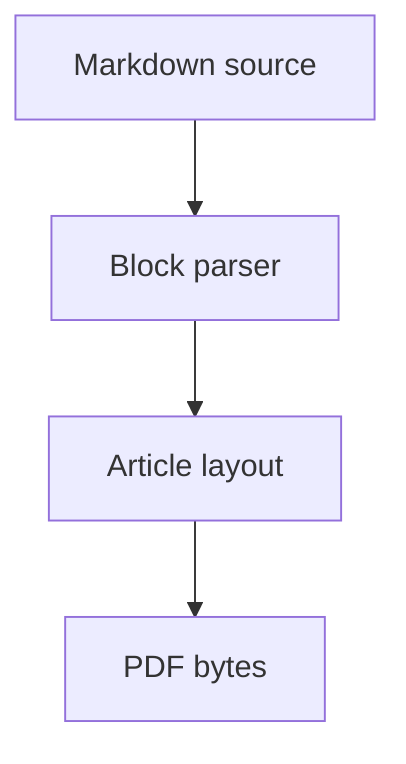

# Portable Mermaid flowchart subset

Date: 2026-06-01

## Scope

This note documents the first Mermaid support in the portable MarkdownPDF
renderer. The implementation is pure Swift and emits direct PDF drawing and text
operators. It applies to macOS and Linux because it does not use Apple-only APIs.
It does not claim iOS support.

No Node, JavaScript, browser renderer, shell renderer, PDFKit, CoreGraphics,
WebKit, LaTeX, C renderer, or external PDF library is involved.

## Supported syntax

The first subset supports Mermaid flowcharts with one statement per line:

Supported graph headers:

- `flowchart TD`
- `flowchart TB`
- `flowchart BT`
- `flowchart LR`
- `flowchart RL`
- `graph` with the same directions

Omitting the direction defaults to top-bottom layout.

Supported node syntax:

- Bare node identifiers: `A`
- Rectangle labels: `A[Label]`
- Quoted rectangle labels: `A["Longer label"]`

Supported edge syntax:

- Solid directed edge: `A --> B`
- Solid directed edge with label: `A -->|label| B`

Node identifiers may contain letters, numbers, underscores, and hyphens. The
renderer records nodes in first-seen order, assigns deterministic graph layers,
and places nodes using deterministic spacing.

## Unsupported syntax

Unsupported Mermaid syntax is rendered as a visible code-block fallback with a
prefix that starts `Unsupported Mermaid diagram:`. This is deliberate. The
renderer must not pretend to support the full Mermaid language and must not call
out to platform-specific or external renderers.

Examples of unsupported syntax in the first subset:

- `sequenceDiagram`
- class diagrams, state diagrams, ER diagrams, Gantt charts, and mind maps
- Styled nodes, classes, themes, subgraphs, shapes other than rectangles, and
  HTML labels
- Dashed or thick arrows such as `-.->`, `---`, or `==>`
- Cyclic flowcharts, because the first layout pass is a deterministic DAG layer
  layout
- Mermaid chart syntax outside the supported pie profile

## Validation

The implementation is validated through:

- Unit tests for supported parsing, graph aliases, quoted labels, edge labels,
  unsupported syntax, and unsupported chart syntax.
- Renderer tests that check supported Mermaid labels are emitted as PDF text and
  the raw Mermaid source is not rendered for supported diagrams.
- Fallback tests that check unsupported syntax remains visible in extracted
  text, including edge labels that cannot be placed without colliding with a
  node.
- Fixture validation using the scientific article fixture.
- Poppler word-box and MuPDF character-quad visual layout tests, now including
  edge-labeled Mermaid diagrams and native Mermaid pie charts, to catch label
  overlap.

## Edge label placement

Edge labels are not drawn opportunistically. During diagram planning, the
renderer measures the label background box and checks it against the diagram
content area and every planned node box. If the label would leave the content
area or collide with a node, the diagram falls back visibly instead of emitting
overlapping text.

This rule is portable across macOS and Linux because it uses the same base-font
measurement tables that drive normal text layout. It does not use CoreGraphics,
CoreText, SVG conversion, or browser measurement.

## Chart policy

Portable flowchart rendering remains a strict Mermaid subset. Mermaid pie charts
are now routed to the native chart renderer, which emits typed PDF drawing
operators in Swift. Other Mermaid chart syntaxes remain visible fallback text
until they have the same structural, text, geometry, and raster witnesses.

## Platform note

This feature is portable macOS/Linux Swift. It is not macOS-only. It does not
use CoreGraphics or CoreText. It does not establish iOS support.
