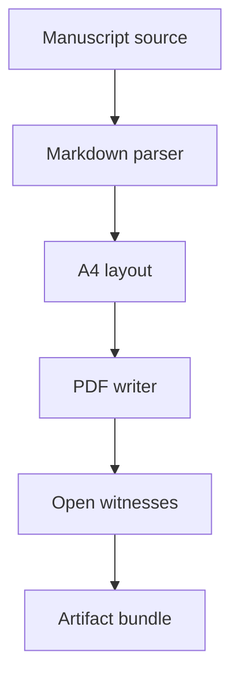
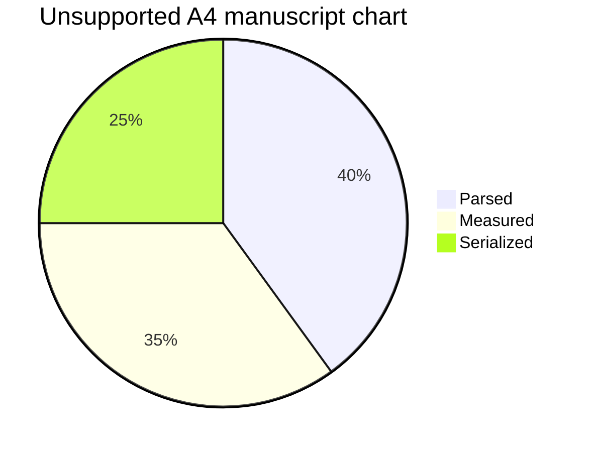

# Portable A4 Manuscript Fixture

Alex Rowan, Priya Hale, Jordan Vale

## Abstract

This synthetic manuscript represents a longer A4 document rather than a compact
stress page. It combines generated table of contents pressure, sustained prose,
wide tables, links, a local figure, a remote figure fallback, supported Mermaid
flowcharts, unsupported Mermaid fallback text, code listings, block quotes, and
plain manuscript sections. The fixture is public, deterministic, and written in
ASCII so the portable base-font profile can be compared on macOS and Linux.

The central claim is ordinary: a Markdown to PDF renderer is useful only when it
survives the shape of a real manuscript. A realistic document has long
paragraphs, section transitions, page turns after figures, dense tables, links
inside prose, and diagrams placed between paragraphs. The witness stack must
inspect the result with independent tools so a human reviewer does not need to
open every page by hand.

Keywords: portable PDF, A4 manuscript, Markdown layout, witness testing,
Mermaid diagrams, table pagination.

## 1. Introduction

Portable PDF generation is not proven by a one-page smoke test. Manuscripts use
longer paragraphs that create many line breaks, headings that need stable
destinations, tables that mix narrow numeric columns with wide description
columns, and figures that must not disturb the text that follows. When a
renderer writes PDF bytes directly, every part of the page tree, content stream,
font resource, image object, annotation, and xref offset has to remain coherent
while the layout engine decides where content belongs.

The A4 page is intentionally explicit in this fixture. Letter and compact test
pages catch different problems, but many technical manuscripts are reviewed on
A4. The tests should prove that the default portable profile can use a normal
paper size with readable margins, stable line spacing, and enough body text to
exercise page turns. The document therefore avoids private data and external
network requirements while still resembling the length and texture of a real
paper.

This introduction continues with a broad paragraph so the first page is not
just metadata and headings. A renderer can appear correct when each block is
small, but errors become visible when paragraphs cross line, block, and page
boundaries. The manuscript repeats natural report language to create sustained
pressure on word spacing, paragraph spacing, and the transition from generated
table of contents entries into the body. Independent tools should agree that the
text is extractable, that words do not overlap, and that every rendered page has
visible ink in the expected bounds.

The reference validation notes are represented by a public placeholder link to
[portable A4 witness notes](https://example.com/research/a4-witness-notes). A
second placeholder reference points to [table measurement
records](https://example.com/research/table-measurements). These links should
produce URI annotations without requiring network access during rendering.

## 2. Manuscript Requirements

The manuscript format creates requirements that are easy to understate in unit
tests. The renderer has to preserve heading order for outlines, generate a table
of contents after pagination settles, place body text without clipping, and keep
long words inside the page bounds. The same renderer also has to place local
images, fall back for remote images, preserve code listing whitespace, and
convert supported Mermaid diagrams into drawn PDF operators instead of leaking
source syntax into the page.

1. Parse the Markdown source into stable block and inline nodes.
2. Measure paragraphs, tables, figures, code blocks, and Mermaid diagrams.
3. Paginate the measured blocks on an explicit A4 media box.
4. Serialize page resources, annotations, outlines, and content streams.
5. Validate the result with structural checks, qpdf, Poppler, and MuPDF.

> A manuscript review usually fails at the boundaries, not in the headline
> case. The paragraph after a table, the first line after an image, and the
> labels inside a diagram all have to be inspected by automated witnesses.

The requirements above are deliberately ordinary. Their value comes from
combination rather than novelty. A single block type can pass a narrow test, but
the manuscript places prose, tables, figures, links, Mermaid, and code in one
flow so layout mistakes have fewer places to hide.

## 3. Methods

The method is to render this source exactly as a caller would render a public
article. The test passes `PDFOptions.PageSize.a4`, normal manuscript margins,
base PDF fonts, a document title, and generated table of contents. The local
figure is created by Swift test support as a small deterministic PNG and is
resolved relative to `assetsBaseURL`. The remote figure is intentionally not
fetched and must remain visible as fallback text.

The main witness pipeline is summarized in the following diagram. The labels in
the flowchart are intentionally short so the supported Mermaid renderer can draw
them directly on an A4 page.



The diagram must render as PDF drawing commands, not as raw Mermaid source.
Prose resumes immediately after the diagram so the test also catches a bad
height estimate for the diagram block. If the diagram consumes too little space,
this paragraph will collide with a node. If it consumes too much space, the next
section will drift unexpectedly or create blank pages.

### 3.1 Local Figure

The local chart below is small, but it is a real image XObject created by the
test suite. The PDF should contain a compressed image stream with the expected
dimensions.


The paragraph after the local figure is part of the manuscript. It verifies that
the text baseline resumes after image placement and that subsequent paragraphs
remain within the A4 media box. Image placement bugs often appear as an overlap
between the figure caption area and the next body paragraph.

### 3.2 Remote Figure Fallback

Remote fetching is outside the portable public profile. This manuscript includes
a remote image reference so the renderer proves that unsupported remote images
stay visible as text.


The fallback should be extractable by Poppler and MuPDF. It should not open a
network connection, shell out to a browser, or silently drop the figure.

## 4. Measurement Tables

The first table is shaped like a manuscript methods table. It mixes left,
center, and right alignment with long prose cells and numeric columns. The row
text is intentionally large enough to exercise wrapping without relying on tiny
page sizes.

| Stage | Evidence collected | Witness expectation | Pages | Risk score |
|:---|:---|:---:|---:|---:|
| Parse | Headings, paragraphs, lists, tables, links, figures, code, Mermaid blocks | Stable extracted labels | 1 | 3 |
| Layout | A4 paragraphs, long tokens, image placements, and table rows | Non-overlapping word boxes | 4 | 5 |
| Serialize | Catalog, pages, resources, annotations, streams, xref, and trailer | qpdf accepts bytes | 4 | 4 |
| Inspect | Poppler text, Poppler TSV, MuPDF structured text, and page rasters | Independent witnesses agree | 4 | 5 |
| Review | Artifact manifest, PDF, text files, geometry files, and rasters | Reviewer can open evidence | 4 | 2 |

The paragraph after the table is intentionally plain. It proves that table
height and row wrapping do not eat the next block. A long manuscript token,
PortableA4ManuscriptFixtureTableWrappingTokenWithoutSpaces, appears in the
middle of this paragraph so the renderer has to wrap it without moving beyond
the right margin or colliding with the next word.

The second table is shaped like a results table. It is wider, more numeric, and
closer to what a technical article would include.

| Scenario | Prose pages | Table rows | Mermaid blocks | Links | Expected witness |
|:---|---:|---:|---:|---:|:---|
| Baseline article | 3 | 5 | 1 | 2 | Text and qpdf pass |
| A4 manuscript | 5 | 13 | 2 | 3 | Full witness stack pass |
| Compact stress | 8 | 5 | 2 | 4 | Page-boundary pressure |
| Oversized blocks | 6 | 1 | 1 | 0 | Fallback and scaling pass |
| Future charts | 5 | 8 | 3 | 3 | Explicit policy before implementation |

The results table is followed by another prose block so row height, alignment,
and continuation behavior remain observable. The numeric columns should not push
text outside the page, and the left-aligned scenario names should remain
extractable as ordinary words.

## 5. Results

The rendered manuscript should span several A4 pages. It should include a table
of contents, internal destinations for headings, URI annotations for links, an
image XObject for the local chart, fallback text for the remote chart, and a
drawn Mermaid flowchart. The output remains small enough for CI, but it is large
enough that page turns happen after mixed content rather than after a single
homogeneous paragraph.

The first result is about text continuity. Poppler text extraction should return
the manuscript title, table of contents, section headings, table labels, remote
figure fallback, Mermaid labels, and the final exit marker. If extraction drops
words or merges words, the resulting text file becomes the first evidence. The
test should fail before a reviewer has to guess from a rendered screenshot.

The second result is about geometry. Poppler word boxes and MuPDF character
quads should stay positive, inside the page, and non-overlapping within the same
line. The checks are intentionally stricter than opening the PDF in a viewer.
Viewers can repair or tolerate bad structure, but text geometry exposes broken
typesetting and spacing.

The third result is about rendered pages. Poppler and MuPDF both rasterize every
page. The comparison checks that both renderers see visible ink and broadly
similar bounds. The test does not pretend to be a pixel-perfect visual snapshot,
but it catches blank pages, clipped content, and major disagreement between
reader implementations.

## 6. Discussion

The most important lesson from a manuscript fixture is that layout bugs become
obvious only after several different blocks interact. A code listing can shift a
heading. A figure can leave the next paragraph too close to the image. A table
can compute a row height that is too small for wrapped text. A diagram can draw
successfully but reserve the wrong amount of vertical space. Each individual
bug looks small, but a manuscript makes the accumulated effect visible to tools.

This fixture also documents the boundary of the portable profile. The renderer
does not use Apple-only frameworks, browser rendering, JavaScript tooling,
LaTeX, or C libraries. It emits PDF bytes directly from Swift and uses external
tools only as test witnesses. That distinction matters because the public
package must build and test on both macOS and Linux.

Unsupported Mermaid diagrams must stay visible as fallback text. The following
block uses a Mermaid chart type that is intentionally outside the supported
flowchart subset.



After the unsupported Mermaid fallback, prose continues again. The fallback text
should be present in extracted text, and the document should still pass qpdf,
Poppler, MuPDF, and raster comparison checks. This gives future chart work a
clear baseline: unsupported charts are visible today, and supported chart
rendering must improve the behavior without removing evidence.

## 7. Code Listing

The manuscript includes a small code listing because technical articles often
mix prose with implementation notes. The line is long enough to wrap within the
page but should remain readable and extractable.

```swift
let data = try MarkdownPDFRenderer(options: PDFOptions(pageSize: .a4, margins: PDFOptions.Margins(top: 56, right: 54, bottom: 56, left: 54), baseFontSize: 11, tableOfContents: .enabled)).render(markdown: manuscript, assetsBaseURL: assetsBaseURL)
```

The paragraph after the code listing is another boundary check. Code blocks use
monospaced metrics and different spacing from normal prose, so the next
paragraph has to resume at a stable baseline. The word
PortableA4ManuscriptFixtureCodeBoundaryTokenWithoutSpaces gives extraction and
wrapping logic another long-token case near the end of the document.

## 8. Conclusion

The manuscript fixture gives the project a realistic A4 document that can be
rendered, inspected, and preserved as CI artifacts. It is not a benchmark for
speed and it is not a claim of full publishing support. It is a working witness
that the portable renderer can handle a public manuscript-shaped input with
tables, images, Mermaid diagrams, links, code, generated table of contents, and
sustained prose.

The final paragraph repeats the key markers for automated extraction: Portable
A4 Manuscript Fixture, A4 local chart, Remote A4 figure, Manuscript source,
Open witnesses, Unsupported A4 manuscript chart, and A4 Manuscript Exit Marker.

A4 Manuscript Exit Marker
