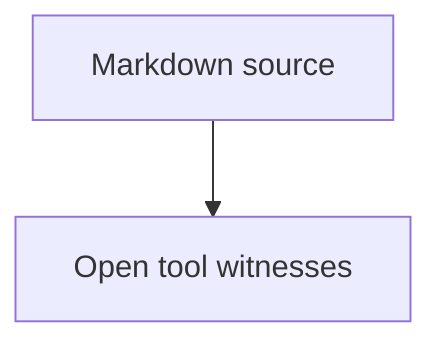

# Portable Article Stress Corpus

Mara Stone, Jun Park, Lin Alvarez

## Abstract

This fixture models an article-grade portable PDF input with generated table of
contents, links, local image placement, remote image fallback, raw HTML fallback,
wide tables, lists, code, Mermaid diagrams, long tokens, and page-boundary
stress. It stays synthetic so it can live in the public repository.

## 1. Scope

The portable renderer must keep a direct PDF byte stream valid while documents
mix ordinary prose with structured technical material. The corpus uses plain
ASCII text because the default public profile uses PDF base fonts and does not
claim complex Unicode shaping.

The reference process is documented at
[portable validation notes](https://example.com/articles/portable-validation).
The link should remain extractable and should produce a URI annotation.

## 2. Field Notes

Authors often combine requirements, numbered decisions, measurements, and
figures in a single report. This section has enough prose to push content toward
page boundaries on compact pages. The lines are intentionally ordinary: they
should wrap without collision, keep word spacing stable, and remain readable in
Poppler and MuPDF extraction.

1. Parse Markdown blocks into a stable document model.
2. Measure text and visual blocks before writing PDF operators.
3. Serialize resources only after each page declares the resources it used.
4. Validate with independent tools rather than visual inspection alone.

## 3. Local Figure

The following standalone image is generated by the test at runtime and resolved
through `assetsBaseURL`.


The paragraph after the image proves that vertical flow resumes after a local
image XObject. If image placement consumes the wrong height, this text collides
with the figure or drifts into the next section.

## 4. Remote Figure Fallback

Remote image fetching is not part of the portable profile. The next figure must
stay visible as fallback text rather than performing network access.


## 5. Wide Result Table

| Phase | Input material | Expected witness | Risk when broken | Recovery signal |
|---|---|---|---|---|
| Parse | Headings, lists, tables, links, and images | Extracted text contains labels | Missing blocks or merged words | Poppler text mismatch |
| Layout | Long paragraphs, long identifiers, and compact pages | No word or glyph overlap | Text outside bounds | TSV or MuPDF geometry issue |
| Serialize | Fonts, XObjects, annotations, and xref offsets | qpdf accepts the file | Reader repair or broken object refs | qpdf failure |
| Render | Poppler and MuPDF page rasters | Comparable ink bounds | Blank pages or clipped content | Raster comparison failure |
| Review | Artifact bundle with manifest | Human can inspect exact witnesses | Missing reproduction evidence | CI artifact upload failure |

The table is followed by prose so row height errors have visible consequences.
The next sentence includes a long token,
PortableArticleGradeFixtureIdentifierWithoutSpacesForWrappingValidation, that
must wrap without entering the page number column or table border.

## 6. Code and Raw HTML

```swift
let pdf = try MarkdownPDFRenderer(options: PDFOptions(tableOfContents: .enabled)).render(markdown: source)
```

<aside>Raw HTML fallback should remain visible monospaced text.</aside>

The code block and raw HTML fallback are presentation features in the portable
profile. They are not interpreted as Swift or HTML by the renderer.

## 7. Diagram Pipeline



After the diagram, prose resumes immediately. This catches diagram height drift,
edge-label collision, and accidental rendering of Mermaid source text.

## 8. Dense Prose

A dense article section repeats realistic report language without private names
or external resources. The renderer should keep line height, paragraph spacing,
and heading spacing stable across several pages. The witness stack should catch
overlap, blank pages, wrong xref offsets, missing image resources, and invalid
annotations.

The second dense paragraph repeats the same concern in a different shape. The
portable renderer should keep URI text, list text, table text, figure fallback
text, and diagram labels extractable. A broken content stream can still open in
a permissive viewer, so qpdf, Poppler, MuPDF, and Swift structural inspection
all stay part of the acceptance surface.

The third dense paragraph exists to force another page turn on compact pages.
When page turns happen near tables or diagrams, the next block must start inside
the media box and below the top margin. The generated ToC should still report
final page numbers after pagination stabilizes.

## 9. Closing Section

The closing section gives the last page enough ink for raster comparison. It
also repeats stable labels that tests can search for: Portable Article Stress
Corpus, Local chart placeholder, Remote measurement plot, Open tool witnesses,
and Raw HTML fallback.
