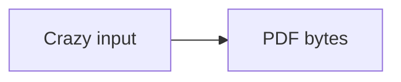
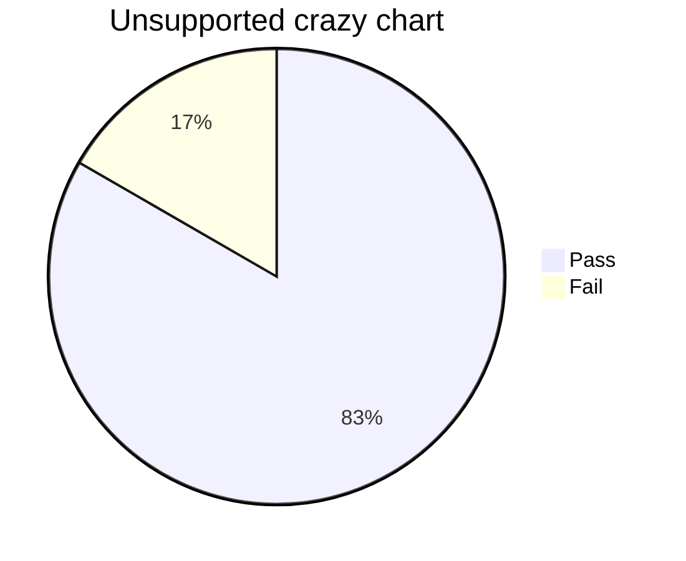

# Crazy Markdown Torture Manuscript

Iris Rowan, Niko Vale, Priya Sen

## Abstract

This manuscript is synthetic and public. It combines dense prose, nested-looking
lists, multiple fenced code languages, wide tables, block quotes, local images,
remote image fallback, reference-style image syntax, supported Mermaid,
unsupported Mermaid, footnote-like notes, raw HTML fallback, very long lines,
and non-ASCII replacement pressure.

The goal is not to prove new Markdown features by declaration. The goal is to
keep every currently portable feature stable when hostile inputs appear in the
same document and cross page boundaries.

## 1. Navigation Links and Autolinks

The first section links to [the operations table](#3-wide-operations-table) and
to [the closing marker](#closing-marker). It also includes an external
reference to [portable fixture evidence](https://example.com/fixtures/crazy)
and a bare autolink <https://example.com/fixtures/crazy/autolink>.

Escaped punctuation should survive extraction: \[literal brackets\],
\*literal stars\*, \`literal backticks\`, \!literal bang, and \#literal hash.

## 2. Deep List Pressure

1. Top ordered item one carries enough prose to wrap across more than one line
   and to reveal whether list indentation remains stable near a page boundary.
2. Top ordered item two names the second phase and includes `inline_code_token`
   beside **strong text**, *emphasis*, and ~~struck text~~.
3. Top ordered item three introduces nested-looking lines below.

- Level one unordered item with a very long body that should wrap instead of
  touching the next marker or entering the page margin.
  - Level two text is intentionally indented. If the parser treats it as plain
    paragraph text, it still must remain visible and separated.
    - Level three text names DeepListLevelThreeMarker so extraction witnesses
      can prove this hostile shape survived.
- Another level one item follows the indented run and checks that normal flow
  resumes without cramming.

## 3. Wide Operations Table

| Phase | Input shape | Witness target | Failure mode | Recovery signal |
|:---|:---|:---:|---:|---|
| Parse | Headings, links, lists, images, raw HTML, and Mermaid fences | Extracted labels | Missing block | Text witness |
| Layout | Dense prose with LongTableTokenWithoutSpacesForWrappingValidationAlphaBetaGammaDelta | Poppler TSV | Overlap | Geometry witness |
| Code | Swift, Metal, JSON, and plain text blocks | MuPDF quads | Glyph collision | Character witness |
| Images | Two local placements, remote fallback, and reference-style syntax | XObject count | Missing image | Resource witness |
| Render | Poppler and MuPDF page rasters | Ink bounds | Blank or clipped page | Raster witness |

The paragraph after this table is deliberately long because row height errors
often appear only when prose resumes below a table. It repeats ordinary words,
wide words like WWWWWW, narrow words like iiiiii, and mixed punctuation so both
Poppler word boxes and MuPDF character quads get enough material to inspect.

## 4. Local and Remote Figures

The same local chart appears twice. The PDF writer should reuse one image
XObject while drawing it twice in document flow.


The paragraph after the first local chart proves that image height was consumed
before ordinary prose resumed.


Remote image fetching is outside the portable profile, so this image must remain
visible fallback text.


Reference-style image syntax is included as hostile input. It is not a renderable
image feature in the current parser, so the syntax must stay visible text rather
than disappearing.

![Reference style local chart][crazy-chart]

[crazy-chart]: local-chart.png "Reference-style chart placeholder"

## 5. Block Quotes Near Headings

> QuoteAlpha begins after dense prose and must not draw a vertical rule stroke.
> It includes inline `quoted_code`, **quoted strong text**, and a long sentence
> that wraps several times on compact pages.
>
> - quoted bullet one should remain inside quote indentation
> - quoted bullet two names QuoteBulletTwoMarker for extraction
>
> > Nested-looking quote text remains part of the quote content and must not
> > collide with the next heading.

## 6. Swift Code Block

```swift
struct TortureRecord {
    let identifier: String
    let values: [Double]
    let metadata: [String: String]
}

let records = (0..<12).map { index in
    TortureRecord(identifier: "record-\(index)", values: [1.0, 2.5, 4.0], metadata: ["phase": "layout"])
}

let longSwiftLine = "SwiftLineWithManySegments_AuthorInput_Parser_Layout_Writer_QPDF_Poppler_MuPDF_RasterWitnesses_ShouldWrapInsideTheCodeBlock"
```

Ordinary prose follows the Swift block so code-height regressions cannot hide.

## 7. Metal Code Block

```metal
kernel void accumulateLighting(
    device const float3 *normals [[buffer(0)]],
    device float3 *output [[buffer(1)]],
    uint id [[thread_position_in_grid]]
) {
    float3 normal = normals[id];
    float visibility = max(dot(normal, float3(0.0, 1.0, 0.0)), 0.0);
    output[id] = float3(visibility, visibility * 0.5, 1.0 - visibility);
}
```

The Metal block is followed by another paragraph because the earlier reported
manual artifacts showed code, quote, paragraph, and heading sequences crammed
together.

## 8. JSON and Plain Text Blocks

```json
{
  "fixture": "crazy-markdown-torture",
  "checks": ["qpdf", "poppler", "mupdf", "raster"],
  "pageSize": "portable",
  "images": { "localDraws": 2, "remoteFallbacks": 1 }
}
```

```text
PlainTextLongLine = "Author input -> Markdown parser -> layout model -> page break planner -> PDF content stream -> qpdf -> Poppler TSV -> MuPDF structured text -> raster comparison -> artifact review"
```

## 9. Mermaid Diagrams



Text after the supported flowchart checks that diagram height does not consume
too little or too much vertical space.



The unsupported chart must remain visible fallback text and must not leak a
false claim of chart support.

## 10. Raw HTML and Footnote-like Notes

<section data-fixture="crazy">Raw HTML fallback for the crazy fixture should remain visible monospaced text.</section>

The paragraph after raw HTML checks normal flow recovery. A footnote marker
[^density] appears here as ordinary text because footnote rendering is not part
of the current portable feature set.

[^density]: Footnote-like note remains visible text and must not be dropped.

## 11. Non-ASCII Replacement

The base PDF font profile is printable ASCII. Unsupported scalars must become
question marks deterministically: Cafe sample is Café, naive sample is naïve,
kanji sample is 漢字, and combining sample is café.

The replacement sentence above is intentionally small but important. It keeps
the behavior explicit until embedded fonts and shaped clusters are selected by
the caller.

## 12. Dense Closing Section

This closing section repeats stable extraction anchors: Crazy Markdown Torture
Manuscript, DeepListLevelThreeMarker, QuoteBulletTwoMarker, Raw HTML fallback,
Unsupported crazy chart, Reference-style chart placeholder, Crazy remote chart,
and Crazy Torture Exit Marker.

Another dense paragraph adds enough tail content for raster witnesses to find
ink on the final page. The text stays synthetic, avoids private names, and keeps
the scope portable across macOS and Linux. If the renderer clips a final page,
the exit marker below disappears from extracted text.

## Closing Marker

Crazy Torture Exit Marker
