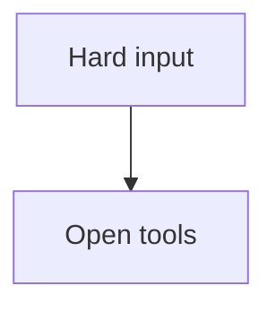
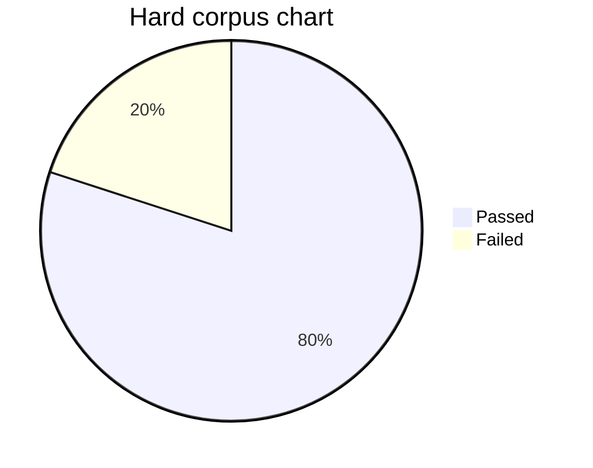

# Portable Hard Markdown Corpus

Casey Morgan, Riley Noor, Taylor Quinn

## Abstract

This fixture is intentionally harder than the article fixtures. It combines
generated table of contents pressure, duplicate headings, internal links, many
external links, nested block quotes, aligned tables with long cells, repeated
local images, remote image fallback, raw HTML fallback, fenced code, supported
Mermaid flowcharts, unsupported Mermaid charts, escaped punctuation, setext
headings, thematic breaks, and page-boundary pressure.

The corpus stays public and synthetic. It uses plain ASCII text so the portable
base-font profile can render it the same way on macOS and Linux.

## 1. Navigation and Links

The first navigation paragraph links to [the repeated heading](#repeated-heading)
and to [the second repeated heading](#repeated-heading-2). The same paragraph
also includes an external reference to [portable witness notes](https://example.com/witnesses/hard-corpus)
and another reference to [artifact review](https://example.com/review/artifacts).

Escaped punctuation should remain extractable: \[literal brackets\],
\*literal stars\*, \`literal backticks\`, and a URL shaped token
https://example.com/path/with/many/segments/that/still/wraps.

## 2. Nested Quotes and Lists

> A quoted requirement starts with dense prose and inline `code`. The renderer
> must preserve quote indentation while the text wraps over several lines on a
> compact page.
>
> - quoted bullet one carries enough text to wrap and reveal marker alignment
> - quoted bullet two includes **strong text**, *emphasis*, and ~~strike text~~
>
> > A nested quote keeps a second indentation level and contains a compact
> > paragraph that should not collide with the surrounding quote border.

1. Ordered item one describes the parsing step and includes PortableHardMarkdownFixtureOrderedListTokenWithoutSpaces.
2. Ordered item two describes layout and links to [section four](#4-tables-with-wide-cells).
3. Ordered item three describes serialization with `xref`, `/Pages`, and `/Resources` markers.

- Unordered item alpha checks bullet spacing after the ordered list.
- Unordered item beta repeats mixed inline styles: **bold**, *italic*, `code`, and ~~strike~~.
- Unordered item gamma is deliberately long enough to create multiple wrapped lines near a page break.

## 3. Repeated Local Figures

The same local image source appears twice. The renderer should reuse the loaded
image resource while still placing both figures in the document flow.


Text after the first local chart proves vertical flow resumed after image
placement. If the height estimate is wrong, this paragraph collides with the
image or starts too low on the next page.


The second placement catches resource reuse mistakes. It should not allocate a
different image object for the same source or leave the page resource dictionary
without the XObject reference.

## 4. Tables With Wide Cells

| Area | Dense content | Expected witness | Failure mode |
|:---|:---|---:|---|
| Parser | Inline `code`, **strong text**, *emphasis*, [links](https://example.com/table/link), and escaped \| characters | Text extraction | Merged cell text |
| Layout | WWWWWW iiiiii minimum maximum allocation fulfillment reproducibility | Poppler TSV | Overlapping word boxes |
| Tables | Long identifier PortableHardMarkdownFixtureTableTokenWithoutSpacesForWrappingValidation | MuPDF character quads | Glyph collision |
| Images | Reused local image and remote fallback in one fixture | PDF resources | Missing XObject |
| Diagrams | Supported flowchart plus unsupported pie chart fallback | Extracted labels | Source leakage |

The prose after the wide table is part of the test. Table row height mistakes
usually show up as this paragraph starting inside the table border or too close
to the following section heading.

## 5. Remote Fallback and Raw HTML

Remote images must remain visible fallback text, without network access.


<section data-fixture="hard-corpus">Raw HTML fallback for the hard corpus should remain visible text.</section>

The paragraph after raw HTML confirms that monospaced fallback text does not
consume an impossible height and does not hide the next normal paragraph.

## 6. Code and Long Lines

```swift
let options = PDFOptions(pageSize: PDFOptions.PageSize(width: 260, height: 320), margins: PDFOptions.Margins(top: 24, right: 22, bottom: 24, left: 22), baseFontSize: 10, tableOfContents: .enabled)
let data = try MarkdownPDFRenderer(options: options).render(markdown: hardCorpus, assetsBaseURL: assetsBaseURL)
```

```text
HardCorpusLongCodeLine = "Author input -> Markdown parser -> Layout model -> PDF content stream -> qpdf -> Poppler TSV -> MuPDF structured text -> raster witnesses"
```

The code blocks are followed by ordinary prose because code-height regressions
often hide until the next block starts in the wrong place.

## 7. Mermaid Flowchart



After the supported flowchart, text should resume with enough separation from
nodes and edge labels. A collision here usually means the diagram height or
edge-label fallback policy changed.

## 8. Native Mermaid Pie Chart



The supported pie chart must render as native PDF drawing operators. It should
not shell out to another renderer or disappear from extracted text.

## Repeated Heading

This is the first repeated heading target. The table of contents and internal
link normalization should point at the first generated destination for the
plain `#repeated-heading` fragment.

## Repeated Heading

This is the second repeated heading target. The generated destination should be
unique, and `#repeated-heading-2` should resolve as an internal destination.

Setext Heading Stress
---------------------

The setext heading should become a level-two heading and participate in the
table of contents. The paragraph below adds enough text to keep this near a
page boundary on compact pages, where heading keep-with-next behavior matters.

---

## 9. Dense Closing Section

The closing section repeats realistic article prose instead of isolated words.
The hard corpus should keep line height, paragraph spacing, quote indentation,
list indentation, table rows, image placements, diagram labels, fallback text,
and link annotations stable across pages.

Another paragraph names the expected extraction anchors outside the diagram:
Portable Hard Markdown Corpus, Raw HTML fallback for the hard corpus,
Hard corpus chart, and Hard Fixture Exit Marker.

Hard Fixture Exit Marker
