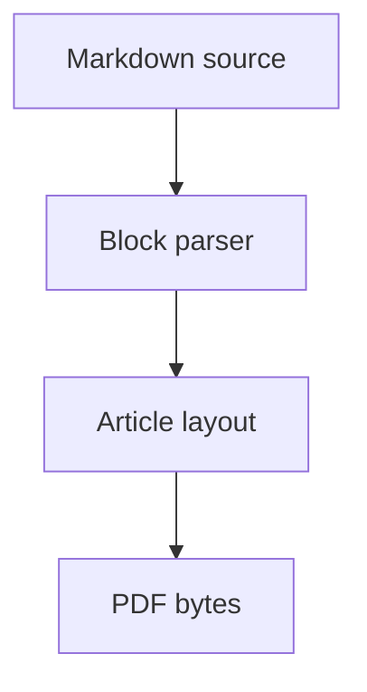

# Reproducible Layout Measurements for Compact Markdown Articles

Alex Rivera, Dana Chen, Priya Shah

## Abstract

This fixture models a short scientific article with sections, citations by link,
tables, a remote figure placeholder, and a Mermaid graph block. It is designed
to exercise document structure without depending on external assets.

## 1. Introduction

Markdown authors often need predictable PDF output for technical manuscripts.
This document checks that headings, paragraphs, links, tables, lists, code
blocks, and image placeholders can appear together in one article-shaped input.

The reproducibility notes are published at
[example research archive](https://example.com/research/layout-measurements).

## 2. Method

The test article uses three synthetic sections:

- a motivation section with prose and one URI annotation
- a tabular result section with mixed alignment
- a graph section represented as Mermaid source

The renderer should keep the document valid even when future macOS rendering
adds richer typography and embedded fonts.

## 3. Results

| Scenario | Median pages | Link annotations | Notes |
|---|---:|---:|---|
| Baseline article | 2 | 1 | Stable pagination target |
| Dense tables | 2 | 1 | Exercises cell alignment |
| Graph appendix | 3 | 1 | Renders flowchart labels |

## 4. Discussion

The fixture intentionally avoids private names, local files, and generated
binary assets. A native macOS renderer can later use the same content to verify
tables, embedded fonts, outlines, and richer graph handling.

## 5. Conclusion

The article should render quickly while still covering document features that
matter for article-grade PDF output.
