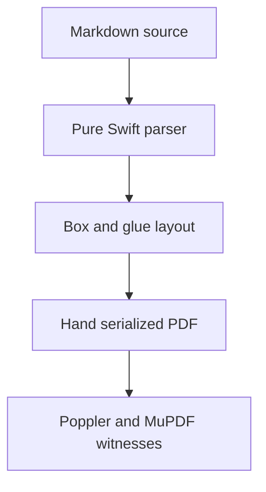

# Combined showcase corpus

A single witness document that mixes multilingual prose, TeX math, native data
charts, a Mermaid flowchart, and mixed-script tables on the same pages, rendered
with an embedded font so the non-ASCII text is real glyphs. CJK is intentionally
omitted because the open CI fonts (DejaVu Sans, Liberation Sans) do not cover it;
the synthetic-font manuscript covers CJK separately.

## Multilingual prose

French: Voilà, à la mode, crème brûlée, déjà vu, Champs-Élysées. German: Grüße,
Mädchen, Fußball, schöner, Zürich. Spanish: ¿Cómo estás? ¡Hola! mañana, niño,
jalapeño, piñata. Nordic and Slavic Latin: Ångström, smörgåsbord, Mötley,
Dvořák, Łódź, žluťoučký kůň.

Russian: Привет, мир! Здравствуйте. Съешь же ещё этих мягких французских булок.
Greek: Καλημέρα κόσμε. Γειά σου. Ελληνικά. Ξεσκεπάζω την ψυχοφθόρα βδελυγμία.

## TeX math

The mass-energy relation $E = mc^2$ and the golden ratio
$\varphi = \frac{1 + \sqrt{5}}{2}$ sit inline alongside diacritic words like
résumé and Привет. Display math holds its own line:

$$\sum_{i=1}^{n} i = \frac{n(n+1)}{2}$$

$$\frac{-b \pm \sqrt{b^2 - 4ac}}{2a}$$

## Native data charts

A bar chart of script coverage:

```chart
type: bar
title: Glyph coverage by script
x-label: Script
y-label: Glyphs
categories: Latin, Cyrillic, Greek
series: Covered = 220, 96, 84
```

A pie chart of fixture composition:

```chart
type: pie
title: Corpus composition
slice: Prose = 40
slice: Tables = 25
slice: Math = 20
slice: Charts = 15
```

A line chart of render time by page size:

```chart
type: line
title: Render time
x-label: Pages
y-label: Milliseconds
x: 1, 2, 4, 8
series: A4 = 12, 19, 33, 61
```

## Mermaid diagram



## Mixed-script table

| Script | Sample | Note | Count |
| :--- | :---: | ---: | ---: |
| Latin | café résumé | accented | 12 |
| Cyrillic | Привет мир | код | 7 |
| Greek | Καλημέρα | Ωμέγα | 3 |
| Mixed | café Привет Ωμέγα | déjà | 99 |

A wide table that forces column measurement and wrapping:

| A | B | C | D | E | F |
| --- | --- | --- | --- | --- | --- |
| a long cell with several words to force wrapping in a narrow column | Привет | Καλημέρα | Zürich | Ωμέγα | Дякую |
| café | résumé | naïve | façade | Mötley | Dvořák |

## Lists and tasks

- [x] Multilingual prose typeset with embedded glyphs
- [x] Inline and display TeX math
- [ ] CJK in the same embedded render (blocked on a covering CI font)

1. Parse the Markdown.
2. Lay out boxes and glue.
3. Serialize the PDF by hand.
