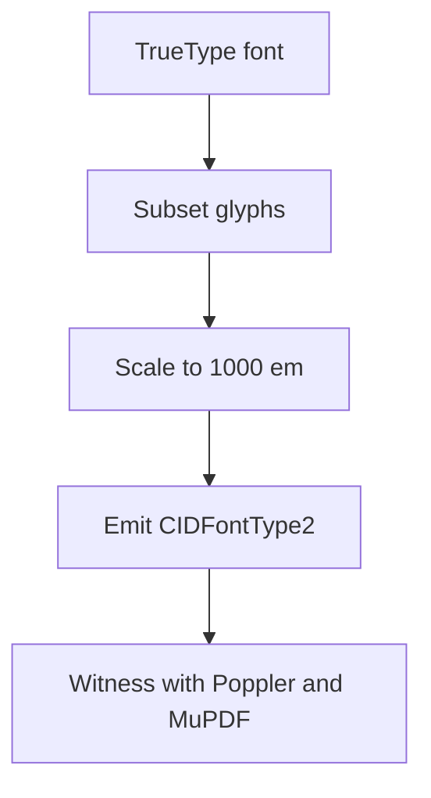

# RFC 0042: Portable Embedded-Font Profile

> Status: Draft. This memo specifies a portable profile and requests discussion.

## 1. Terminology

The key words **MUST**, **SHOULD**, and **MAY** are to be interpreted as
described in common RFC usage.

## 2. Scope

This profile covers Type0 / CIDFontType2 embedding with `FontFile2` streams and
ToUnicode maps. It does **not** cover CFF (`FontFile3`) or web font containers.

## 3. Requirements

1. The renderer MUST scale CID `/W` widths to 1000-unit glyph space.
2. The renderer MUST scale FontDescriptor metrics to 1000-unit glyph space.
3. The renderer SHOULD reject fonts whose OS/2 bits forbid embedding.
4. Fixtures MAY use the open CI fonts via `MARKDOWNPDF_OPEN_FONT_PATH`.

## 4. Reference code

```swift
let scaled = Int((Double(advance) * 1000.0 / unitsPerEm).rounded())
```

```python
def scale(advance, units_per_em):
    return round(advance * 1000 / units_per_em)
```

```json
{ "FontBBox": [-21, -236, 487, 47], "Ascent": 372, "Descent": -98 }
```

## 5. Pipeline



## 6. Test matrix

| Font | unitsPerEm | Scaled W | Status |
| :--- | ---: | ---: | :---: |
| DejaVu Sans | 2048 | yes | pass |
| Liberation Sans | 2048 | yes | pass |
| Synthetic | 1000 | identity | pass |

## 7. Open questions

- [ ] CFF (`FontFile3`) embedding
- [ ] WOFF / WOFF2 decompression
- [x] CID `/W` and descriptor scaling
