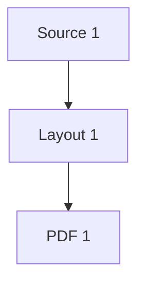
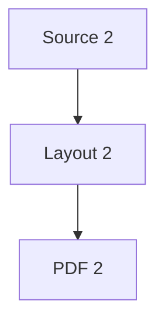
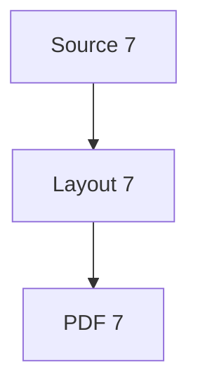
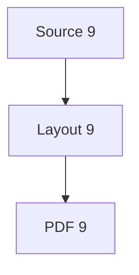
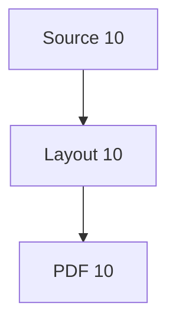
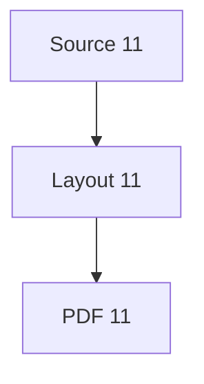
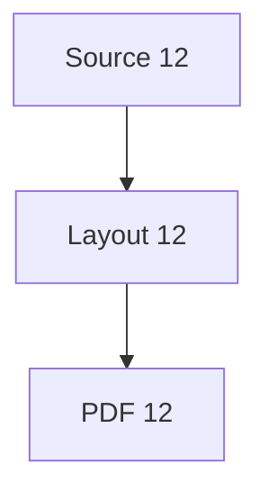

# The Grand Multilingual Engineering Handbook

A large witness document combining multilingual prose (Latin-diacritic, Cyrillic, Greek), display mathematics, native charts, Mermaid diagrams, and mixed-script tables across fourteen chapters. CJK is omitted because the open CI fonts do not cover it.

## Table of contents

Each chapter exercises prose, mathematics, a chart, a diagram, and a table on shared pages.

## Chapter 1. Foundations · Основы · Θεμέλια

À la mode, crème brûlée, déjà vu: la façade rénovée des Champs-Élysées. Les frères Müller à Zürich, Łódź, Tromsø.

Привет, мир! Здравствуйте. Съешь же ещё этих мягких французских булок да выпей чаю. Москва, Київ, Україна.

### Equation

$$E = mc^2$$

### Chart

```chart
type: bar
title: Couverture 1
x-label: Script
y-label: Glyphes
categories: Latin, Cyrillic, Greek
series: Couverts = 201, 91, 81
```

### Diagram



### Table

| Script | Échantillon | Note | N |
| :--- | :---: | ---: | ---: |
| Latin | café résumé | accentué | 3 |
| Cyrillic | Привет мир | код | 2 |
| Greek | Καλημέρα | Ωμέγα | 1 |

## Chapter 2. Parsing · Разбор · Ανάλυση

Привет, мир! Здравствуйте. Съешь же ещё этих мягких французских булок да выпей чаю. Москва, Київ, Україна.

Καλημέρα κόσμε. Η ελληνική γλώσσα: αβγδε ζηθικλμ νξοπρσ τυφχψω, ΑΒΓΔΕ ΖΗΘ ΙΚΛ ΜΝΞ. Γειά σου.

### Equation

$$\sum_{i=1}^{n} i = \frac{n(n+1)}{2}$$

### Chart

```chart
type: line
title: Couverture 2
x-label: Script
y-label: Glyphes
categories: Latin, Cyrillic, Greek
series: Couverts = 202, 92, 82
```

### Diagram



### Table

| Script | Échantillon | Note | N |
| :--- | :---: | ---: | ---: |
| Latin | café résumé | accentué | 6 |
| Cyrillic | Привет мир | код | 4 |
| Greek | Καλημέρα | Ωμέγα | 2 |

## Chapter 3. Layout · Вёрстка · Διάταξη

Καλημέρα κόσμε. Η ελληνική γλώσσα: αβγδε ζηθικλμ νξοπρσ τυφχψω, ΑΒΓΔΕ ΖΗΘ ΙΚΛ ΜΝΞ. Γειά σου.

Mixed scripts: café Привет Καλημέρα Zürich Ωμέγα Dvořák Łódź žluťoučký déjà naïve Œuvres complètes.

### Equation

$$\sqrt{a^2 + b^2} = c$$

### Chart

```chart
type: bar
title: Couverture 3
x-label: Script
y-label: Glyphes
categories: Latin, Cyrillic, Greek
series: Couverts = 203, 93, 83
```

### Diagram


### Table

| Script | Échantillon | Note | N |
| :--- | :---: | ---: | ---: |
| Latin | café résumé | accentué | 9 |
| Cyrillic | Привет мир | код | 6 |
| Greek | Καλημέρα | Ωμέγα | 3 |

## Chapter 4. Fonts · Шрифты · Γραμματοσειρές

Mixed scripts: café Привет Καλημέρα Zürich Ωμέγα Dvořák Łódź žluťoučký déjà naïve Œuvres complètes.

À la mode, crème brûlée, déjà vu: la façade rénovée des Champs-Élysées. Les frères Müller à Zürich, Łódź, Tromsø.

### Equation

$$x = \frac{-b \pm \sqrt{b^2 - 4ac}}{2a}$$

### Chart

```chart
type: line
title: Couverture 4
x-label: Script
y-label: Glyphes
categories: Latin, Cyrillic, Greek
series: Couverts = 204, 94, 84
```

### Diagram


### Table

| Script | Échantillon | Note | N |
| :--- | :---: | ---: | ---: |
| Latin | café résumé | accentué | 12 |
| Cyrillic | Привет мир | код | 8 |
| Greek | Καλημέρα | Ωμέγα | 4 |

## Chapter 5. Mathematics · Математика · Μαθηματικά

À la mode, crème brûlée, déjà vu: la façade rénovée des Champs-Élysées. Les frères Müller à Zürich, Łódź, Tromsø.

Привет, мир! Здравствуйте. Съешь же ещё этих мягких французских булок да выпей чаю. Москва, Київ, Україна.

### Equation

$$\varphi = \frac{1 + \sqrt{5}}{2}$$

### Chart

```chart
type: bar
title: Couverture 5
x-label: Script
y-label: Glyphes
categories: Latin, Cyrillic, Greek
series: Couverts = 205, 95, 85
```

### Diagram


### Table

| Script | Échantillon | Note | N |
| :--- | :---: | ---: | ---: |
| Latin | café résumé | accentué | 15 |
| Cyrillic | Привет мир | код | 10 |
| Greek | Καλημέρα | Ωμέγα | 5 |

## Chapter 6. Tables · Таблицы · Πίνακες

Привет, мир! Здравствуйте. Съешь же ещё этих мягких французских булок да выпей чаю. Москва, Київ, Україна.

Καλημέρα κόσμε. Η ελληνική γλώσσα: αβγδε ζηθικλμ νξοπρσ τυφχψω, ΑΒΓΔΕ ΖΗΘ ΙΚΛ ΜΝΞ. Γειά σου.

### Equation

$$E = mc^2$$

### Chart

```chart
type: bar
title: Couverture 6
x-label: Script
y-label: Glyphes
categories: Latin, Cyrillic, Greek
series: Couverts = 206, 96, 86
```

### Diagram


### Table

| Script | Échantillon | Note | N |
| :--- | :---: | ---: | ---: |
| Latin | café résumé | accentué | 18 |
| Cyrillic | Привет мир | код | 12 |
| Greek | Καλημέρα | Ωμέγα | 6 |

## Chapter 7. Charts · Графики · Διαγράμματα

Καλημέρα κόσμε. Η ελληνική γλώσσα: αβγδε ζηθικλμ νξοπρσ τυφχψω, ΑΒΓΔΕ ΖΗΘ ΙΚΛ ΜΝΞ. Γειά σου.

Mixed scripts: café Привет Καλημέρα Zürich Ωμέγα Dvořák Łódź žluťoučký déjà naïve Œuvres complètes.

### Equation

$$\sum_{i=1}^{n} i = \frac{n(n+1)}{2}$$

### Chart

```chart
type: line
title: Couverture 7
x-label: Script
y-label: Glyphes
categories: Latin, Cyrillic, Greek
series: Couverts = 207, 97, 87
```

### Diagram



### Table

| Script | Échantillon | Note | N |
| :--- | :---: | ---: | ---: |
| Latin | café résumé | accentué | 21 |
| Cyrillic | Привет мир | код | 14 |
| Greek | Καλημέρα | Ωμέγα | 7 |

## Chapter 8. Diagrams · Диаграммы · Σχήματα

Mixed scripts: café Привет Καλημέρα Zürich Ωμέγα Dvořák Łódź žluťoučký déjà naïve Œuvres complètes.

À la mode, crème brûlée, déjà vu: la façade rénovée des Champs-Élysées. Les frères Müller à Zürich, Łódź, Tromsø.

### Equation

$$\sqrt{a^2 + b^2} = c$$

### Chart

```chart
type: bar
title: Couverture 8
x-label: Script
y-label: Glyphes
categories: Latin, Cyrillic, Greek
series: Couverts = 208, 98, 88
```

### Diagram


### Table

| Script | Échantillon | Note | N |
| :--- | :---: | ---: | ---: |
| Latin | café résumé | accentué | 24 |
| Cyrillic | Привет мир | код | 16 |
| Greek | Καλημέρα | Ωμέγα | 8 |

## Chapter 9. Color · Цвет · Χρώμα

À la mode, crème brûlée, déjà vu: la façade rénovée des Champs-Élysées. Les frères Müller à Zürich, Łódź, Tromsø.

Привет, мир! Здравствуйте. Съешь же ещё этих мягких французских булок да выпей чаю. Москва, Київ, Україна.

### Equation

$$x = \frac{-b \pm \sqrt{b^2 - 4ac}}{2a}$$

### Chart

```chart
type: line
title: Couverture 9
x-label: Script
y-label: Glyphes
categories: Latin, Cyrillic, Greek
series: Couverts = 209, 99, 89
```

### Diagram



### Table

| Script | Échantillon | Note | N |
| :--- | :---: | ---: | ---: |
| Latin | café résumé | accentué | 27 |
| Cyrillic | Привет мир | код | 18 |
| Greek | Καλημέρα | Ωμέγα | 9 |

## Chapter 10. Pagination · Пагинация · Σελιδοποίηση

Привет, мир! Здравствуйте. Съешь же ещё этих мягких французских булок да выпей чаю. Москва, Київ, Україна.

Καλημέρα κόσμε. Η ελληνική γλώσσα: αβγδε ζηθικλμ νξοπρσ τυφχψω, ΑΒΓΔΕ ΖΗΘ ΙΚΛ ΜΝΞ. Γειά σου.

### Equation

$$\varphi = \frac{1 + \sqrt{5}}{2}$$

### Chart

```chart
type: bar
title: Couverture 10
x-label: Script
y-label: Glyphes
categories: Latin, Cyrillic, Greek
series: Couverts = 210, 100, 90
```

### Diagram



### Table

| Script | Échantillon | Note | N |
| :--- | :---: | ---: | ---: |
| Latin | café résumé | accentué | 30 |
| Cyrillic | Привет мир | код | 20 |
| Greek | Καλημέρα | Ωμέγα | 10 |

## Chapter 11. Witnesses · Свидетели · Μάρτυρες

Καλημέρα κόσμε. Η ελληνική γλώσσα: αβγδε ζηθικλμ νξοπρσ τυφχψω, ΑΒΓΔΕ ΖΗΘ ΙΚΛ ΜΝΞ. Γειά σου.

Mixed scripts: café Привет Καλημέρα Zürich Ωμέγα Dvořák Łódź žluťoučký déjà naïve Œuvres complètes.

### Equation

$$E = mc^2$$

### Chart

```chart
type: bar
title: Couverture 11
x-label: Script
y-label: Glyphes
categories: Latin, Cyrillic, Greek
series: Couverts = 211, 101, 91
```

### Diagram



### Table

| Script | Échantillon | Note | N |
| :--- | :---: | ---: | ---: |
| Latin | café résumé | accentué | 33 |
| Cyrillic | Привет мир | код | 22 |
| Greek | Καλημέρα | Ωμέγα | 11 |

## Chapter 12. Performance · Производительность · Απόδοση

Mixed scripts: café Привет Καλημέρα Zürich Ωμέγα Dvořák Łódź žluťoučký déjà naïve Œuvres complètes.

À la mode, crème brûlée, déjà vu: la façade rénovée des Champs-Élysées. Les frères Müller à Zürich, Łódź, Tromsø.

### Equation

$$\sum_{i=1}^{n} i = \frac{n(n+1)}{2}$$

### Chart

```chart
type: line
title: Couverture 12
x-label: Script
y-label: Glyphes
categories: Latin, Cyrillic, Greek
series: Couverts = 212, 102, 92
```

### Diagram



### Table

| Script | Échantillon | Note | N |
| :--- | :---: | ---: | ---: |
| Latin | café résumé | accentué | 36 |
| Cyrillic | Привет мир | код | 24 |
| Greek | Καλημέρα | Ωμέγα | 12 |

## Chapter 13. Portability · Переносимость · Φορητότητα

À la mode, crème brûlée, déjà vu: la façade rénovée des Champs-Élysées. Les frères Müller à Zürich, Łódź, Tromsø.

Привет, мир! Здравствуйте. Съешь же ещё этих мягких французских булок да выпей чаю. Москва, Київ, Україна.

### Equation

$$\sqrt{a^2 + b^2} = c$$

### Chart

```chart
type: bar
title: Couverture 13
x-label: Script
y-label: Glyphes
categories: Latin, Cyrillic, Greek
series: Couverts = 213, 103, 93
```

### Diagram


### Table

| Script | Échantillon | Note | N |
| :--- | :---: | ---: | ---: |
| Latin | café résumé | accentué | 39 |
| Cyrillic | Привет мир | код | 26 |
| Greek | Καλημέρα | Ωμέγα | 13 |

## Chapter 14. Conclusions · Выводы · Συμπεράσματα

Привет, мир! Здравствуйте. Съешь же ещё этих мягких французских булок да выпей чаю. Москва, Київ, Україна.

Καλημέρα κόσμε. Η ελληνική γλώσσα: αβγδε ζηθικλμ νξοπρσ τυφχψω, ΑΒΓΔΕ ΖΗΘ ΙΚΛ ΜΝΞ. Γειά σου.

### Equation

$$x = \frac{-b \pm \sqrt{b^2 - 4ac}}{2a}$$

### Chart

```chart
type: line
title: Couverture 14
x-label: Script
y-label: Glyphes
categories: Latin, Cyrillic, Greek
series: Couverts = 214, 104, 94
```

### Diagram


### Table

| Script | Échantillon | Note | N |
| :--- | :---: | ---: | ---: |
| Latin | café résumé | accentué | 42 |
| Cyrillic | Привет мир | код | 28 |
| Greek | Καλημέρα | Ωμέγα | 14 |

## Appendix

End of the grand handbook. Tous les scripts, все скрипты, όλα τα σενάρια.
