# US Patent 8,130,226
## Framework for Graphics Animation and Compositing Operations

US Patent 8,130,226 B2 was granted to inventors Ralph Brunner (Cupertino, CA), John Harper (San Francisco, CA), and Peter N. Graffagnino (San Francisco, CA), and assigned to Apple Inc. The application was filed on May 31, 2007 (Appl. No. 11/756,331) as a continuation-in-part of application 11/500,154 filed August 4, 2006. It published as US 2008/0030504 A1 on February 7, 2008 and was granted on March 6, 2012. The Primary Examiner was Daniel Hajnik, and the law firm of record is Wong, Cabello, Lutsch, Rutherford and Brucculeri, LLP.

The patent describes the framework that became known commercially as Core Animation. The abstract teaches a framework for performing graphics animation and compositing operations having a layer tree for interfacing with the application and a render tree for interfacing with a render engine. Layers in the layer tree can be content, windows, views, video, images, text, media, or any other type of object for a user interface of an application. The application commits changes to the state of the layers of the layer tree. The application does not need to include explicit code for animating the changes to the layers. Instead, an animation is determined for animating the change in state. In determining the animation, the framework can define a set of predetermined animations based on motion, visibility, and transition. The determined animation is explicitly applied to the affected layers in the render tree. A render engine renders from the render tree into a frame buffer for display on the processing device.

The patent contains 40 claims and 8 drawing sheets. Its independent claims (Claim 1 and Claim 9) cover methods of processing graphical content for application programs by maintaining a plurality of renderable objects independently of application graphical content, making implicit animations available for automatically animating properties, identifying modifications, determining implicit animations independent of the application change, and animating the affected renderable objects. The file-listing appendix incorporates 15 Objective-C header files including CAAnimation, CABase, CALayer, CAMediaTiming, CAMediaTimingFunction, CAOpenGLLayer, CARenderer, CAScrollLayer, CATextLayer, CATiledLayer, CATransaction, CATransform3D, CAConstraintLayoutManager, CACIFilterAdditions, and CoreAnimation.

---

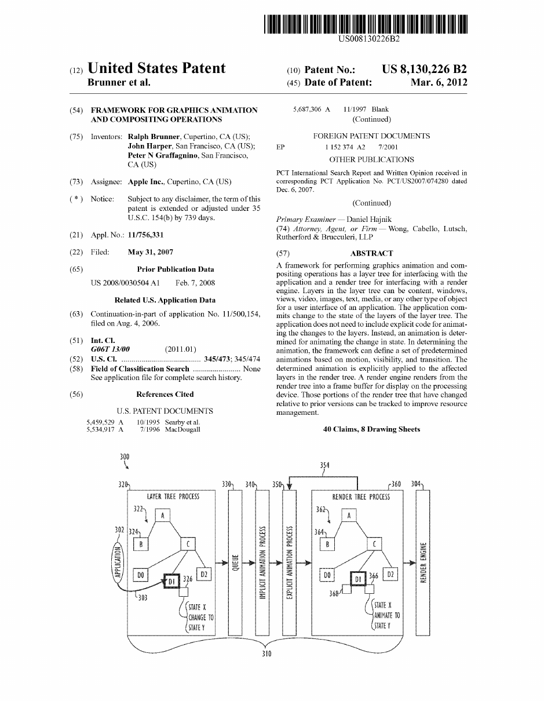

Title page. The face sheet identifies the patent as US 8,130,226 B2 issued to Brunner et al. on March 6, 2012. It titles the invention Framework for Graphics Animation and Compositing Operations. Inventors are listed as Ralph Brunner of Cupertino, John Harper of San Francisco, and Peter N. Graffagnino of San Francisco. The assignee is Apple Inc. of Cupertino, California. The notice recites that the term of this patent was extended or adjusted under 35 U.S.C. 154(b) by 739 days. Application number 11/756,331 was filed May 31, 2007 and the prior publication US 2008/0030504 A1 dates from February 7, 2008. The Related U.S. Application Data section notes the continuation-in-part of 11/500,154 filed August 4, 2006. International classification is G06T 13/00 (2011.01), U.S. Cl. 345/473; 345/474. The cited references list starts with Searby et al. (1995), MacDougall (1996), and Blank (1997). A foreign patent document EP 1 152 374 A2 (July 2001) is cited alongside the PCT International Search Report for PCT/US2007/074280 dated December 6, 2007. The Primary Examiner is Daniel Hajnik, the Attorney, Agent, or Firm is Wong, Cabello, Lutsch, Rutherford and Brucculeri, LLP. The abstract appears at bottom right and the patent consists of 40 Claims and 8 Drawing Sheets. A thumbnail of Figure 3 is printed at the top right showing the layer tree process interacting with the render tree process and the state X to state Y transition.

---

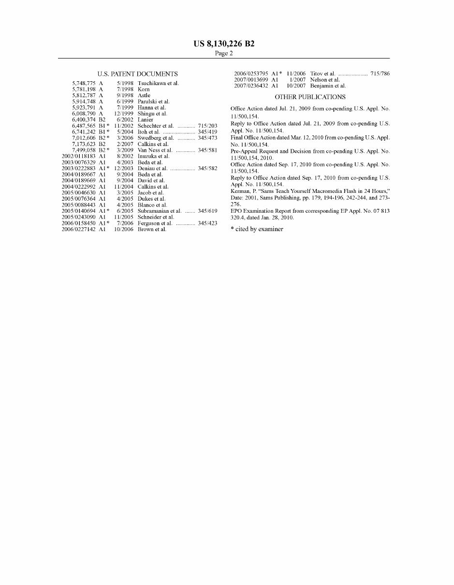

Page 2 of the face sheet, continued references and other publications. Additional U.S. patent documents cited include Tsuchikawa et al. (1998), Korn (1998), Astle (1998), Parulski et al. (1999), Hanna et al. (1999), Shingu et al. (1999), Lanier (2002), Schechter et al. (2002), Itoh et al. (2004), Swedberg et al. (2006), Calkins et al. (2007), and Van Ness et al. (2009). Published applications cited include Inuzuka et al., Beda et al. (2003 and 2004), Deniau et al., David et al., Calkins et al., Jacob et al., Dukes et al., Blanco et al., Subramanian et al., Schneider et al., Ferguson et al., Brown et al., Titov et al., Nelson et al., and Benjamin et al. Other Publications cites Office Actions and replies dated July 21, 2009, March 12, 2010, and September 17, 2010 from co-pending application 11/500,154, a Pre-Appeal Request, and Kerman, P. "Sams Teach Yourself Macromedia Flash in 24 Hours" (Sams Publishing, 2001, pp. 179, 194-196, 242-244, 273-276). The EPO Examination Report from EP Appl. No. 07813320.4 dated January 28, 2010 is also cited.

---

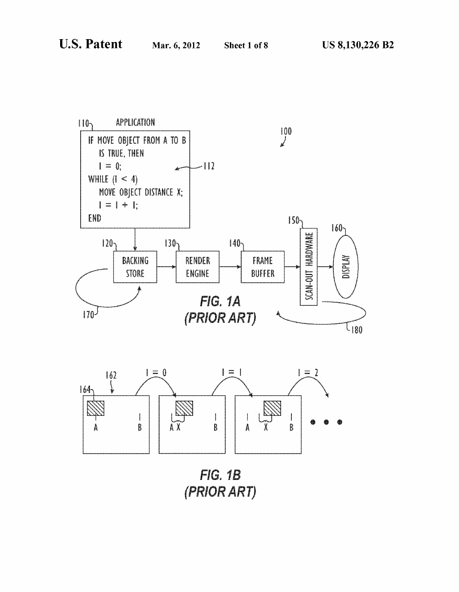

Figure 1A (Prior Art). The page is labeled Sheet 1 of 8 and illustrates the prior art rendering process. It shows an Application containing a pseudo-code loop for moving an object from point A to point B:

> "IF MOVE OBJECT FROM A TO B IS TRUE, THEN i = 0; WHILE ( i < 4 ) MOVE OBJECT DISTANCE X;"

The application feeds a Backing Store, which passes drawing commands through a Render Engine (using Core Image and Core Video) into a Frame Buffer, then through Scan-Out Hardware at a frame rate to a Display. The figure establishes the problem the patent solves: the application itself must contain an explicit iterative loop to animate the movement of a view.

---

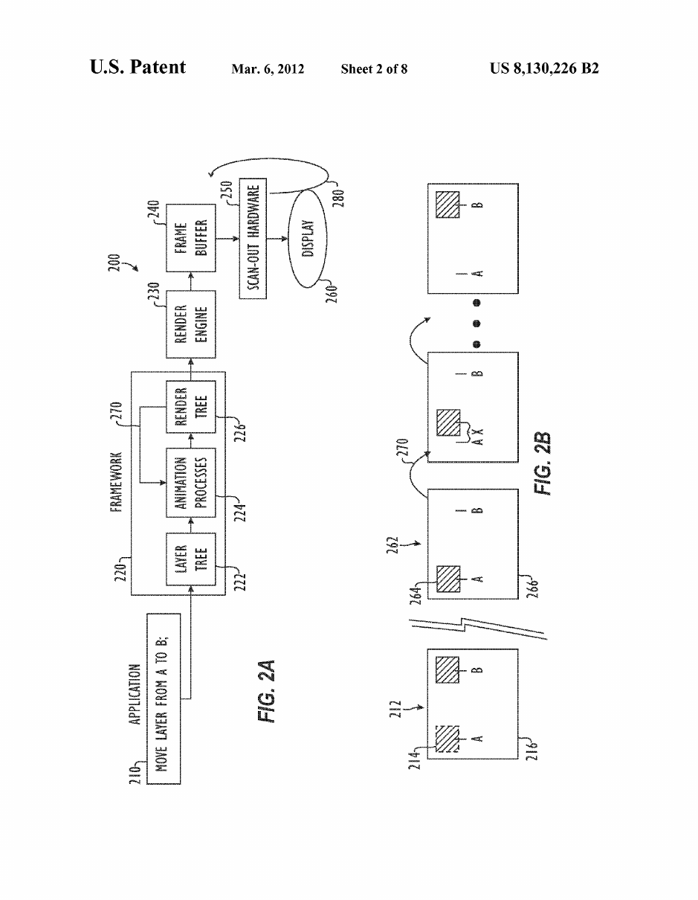

Figure 1B (Prior Art). Sheet 2 of 8. Shows example results produced by the prior art rendering process of Figure 1A. A sequence of displayed frames depicts an object at intermediate positions between start point A and end point B, drawn incrementally as the iterative loop 112 steps the object a distance X per iteration. The figure demonstrates how the developer must decide the number of snapshots, and that each step in the animation is driven by application code rather than by a framework.

---

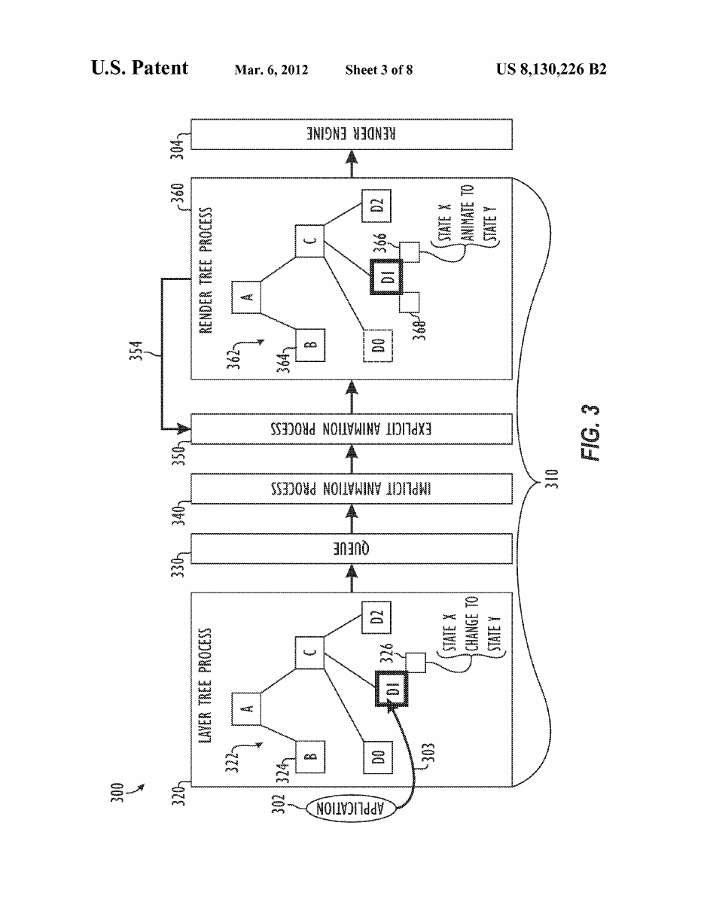

Figure 2A. Sheet 3 of 8. Illustrates an embodiment of the rendering process 200 according to the teachings of the disclosure. An Application 210 (now containing no embedded animation loop) commits GUI changes into a Core Animation framework 220. The framework is divided into a layer tree 222 (which interfaces with the application), an animation and compositing process 224, and a render tree 226. The render engine 230 renders from the render tree into a frame buffer 240, which drives scan-out hardware 250 to a display 260 at frame rate 280. The figure contrasts with Figure 1A by showing that the application supplies only end-state changes, while implicit animation and compositing are determined and applied by the framework.

---

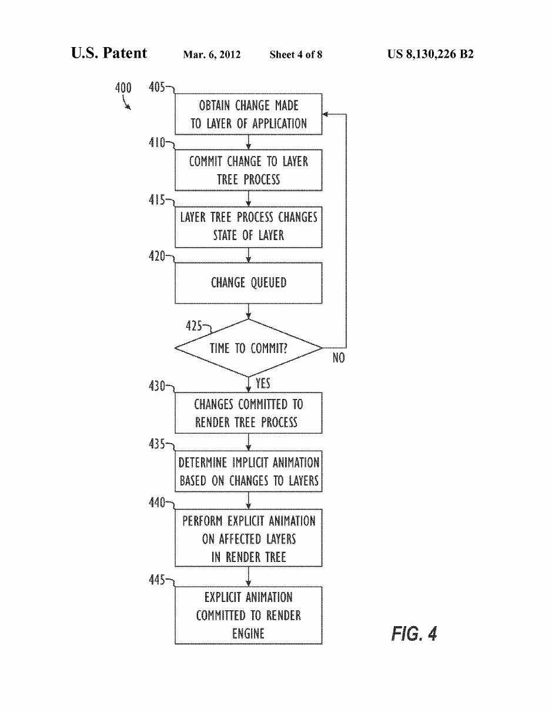

Figure 2B. Sheet 4 of 8. Shows example results of the rendering process of Figure 2A. The top section illustrates a layer 214 in a layout boundary 216 being changed from start state A to end state B by the application, representing the instant change reflected in the layer tree. The bottom section shows the animated sequence in the render tree: an associated render tree layer 264 in layout boundary 266 being stepped incrementally from A to B, animated by the explicit animation process over a period of time. This demonstrates separation of immediate application state changes from the frame-rate-synchronized animation.

---

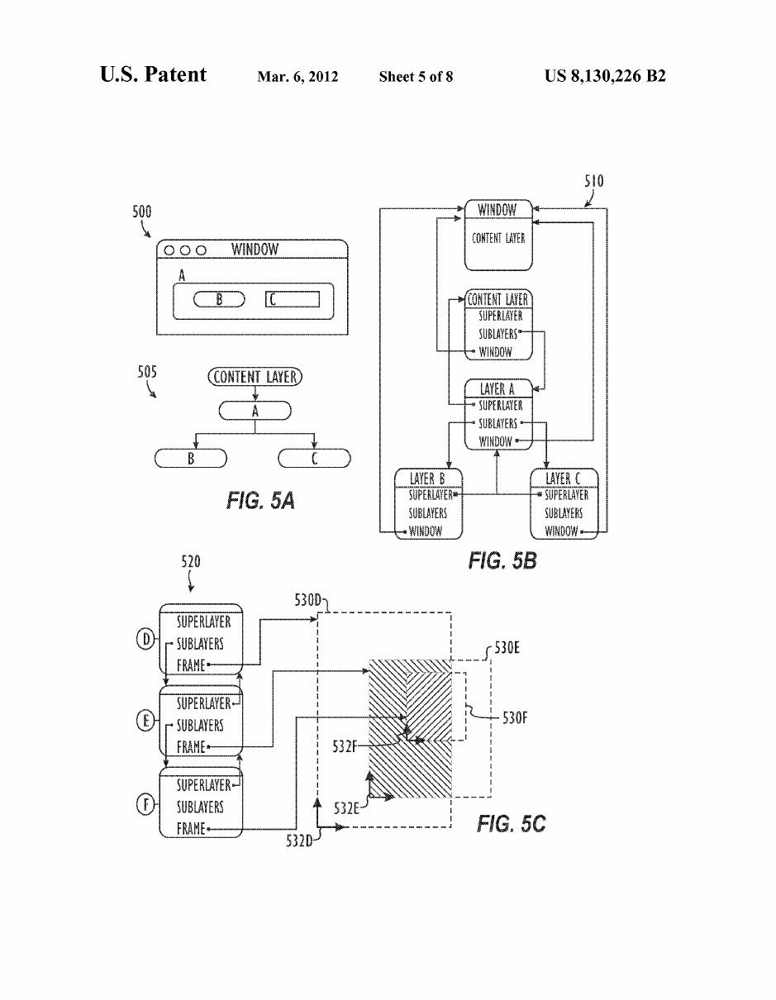

Figure 3. Sheet 5 of 8 (portion). Illustrates the rendering process 300 with an embodiment of the Core Animation framework 310. The application 302 commits changes 303 to a layer tree process 320 containing a layer tree 322 of first layers 324 (model objects) in a hierarchical structure. Changes are queued in queue 330 and passed to an implicit animation process 340 and an explicit animation process 350. The results are applied to a render tree process 360 containing a render tree 362 of second layers 364 (renderable objects) with an associated animation object 366 appended to a changed node D1. The render engine 304 renders from the render tree. The figure shows a node D1 transitioning from State X to State Y, the key illustration of the invention's state-based implicit animation model.

---

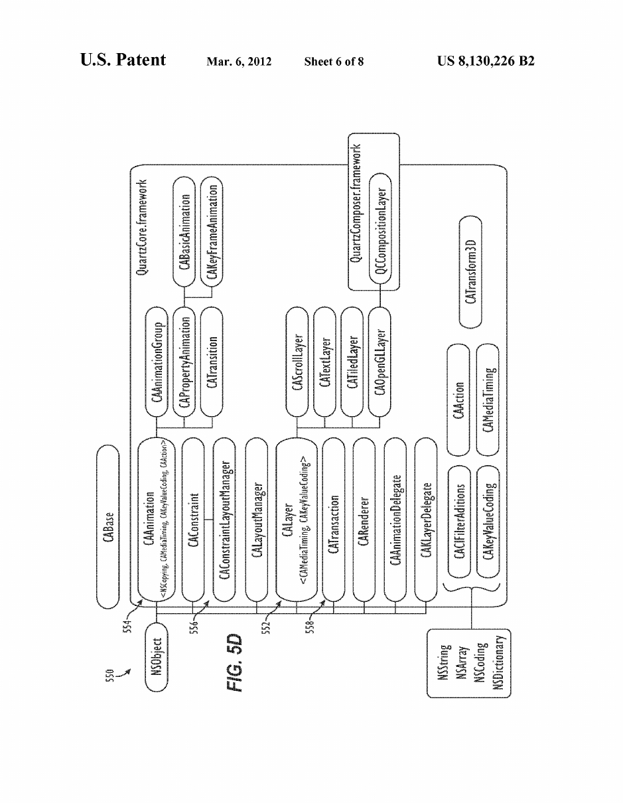

Figure 4. Sheet 6 of 8. Shows the rendering process 300 of Figure 3 in flow chart form as process 400. The flow is:

- Block 405: Obtain change made to layer of application.
- Block 410: Commit change to layer tree process.
- Block 415: Layer tree process changes state of affected layer.
- Block 420: Queue state change.
- Block 425: Decision point, whether it is time to commit the batched state changes.
- Block 430: Commit state changes to implicit animation process.
- Block 435: Determine animation based on state change context.
- Block 440: Explicit animation process applies the determined animations to the associated layers in the render tree.
- Block 445: Commit explicit animations to render engine and display.

---

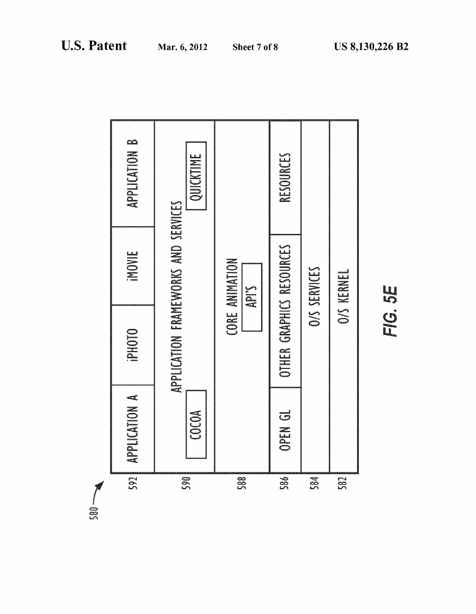

Figures 5A and 5B. Sheet 5 of 8 drawings. Figure 5A shows a window 500 of a GUI containing three layers labeled A, B, and C, along with the corresponding layer hierarchy 505 which places the window's content layer at the top, layer A as a sublayer of content, and layers B and C as sublayers of A. Figure 5B shows the hierarchical relationships 510 between layers A, B, C, and Content explicitly as nodes connected by superlayer and sublayer references. The figures establish the vocabulary superlayer and sublayer used throughout the detailed description.

---

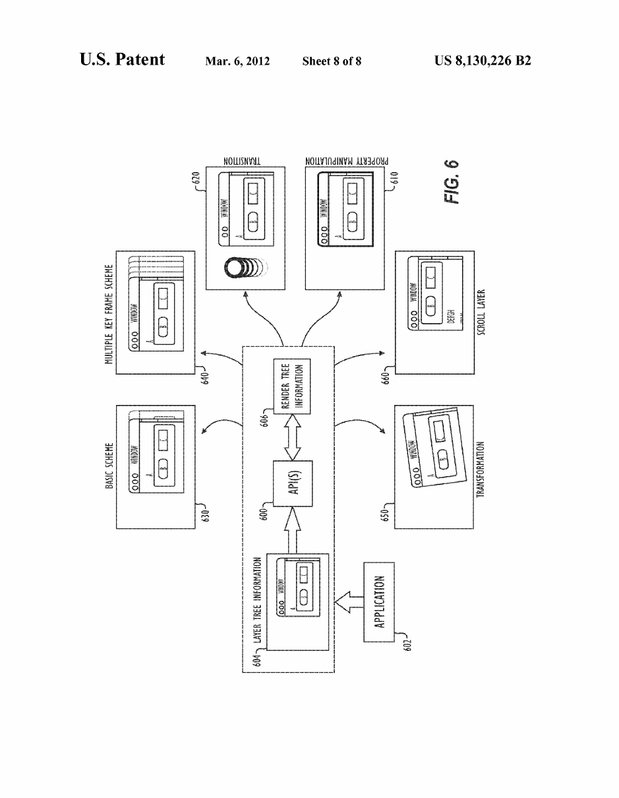

Figure 5C. Sheet 6 of 8. Illustrates the relationships for three example layers 520D, 520E, and 520F where 520D is the superlayer of 520E and 520E is the superlayer of 520F. Each layer is shown with its corresponding frame rectangle 530D, 530E, 530F and its own coordinate system 532D, 532E, 532F. The frame rectangle 530E of layer 520E is shown positioned within the coordinate system 532D of 520D, and frame rectangle 530F of 520F lies within the coordinate system 532E of 520E. The figure also indicates that a sublayer's frame can extend outside its superlayer's frame rectangle, contrasting with NSView semantics where sublayers are clipped.

---

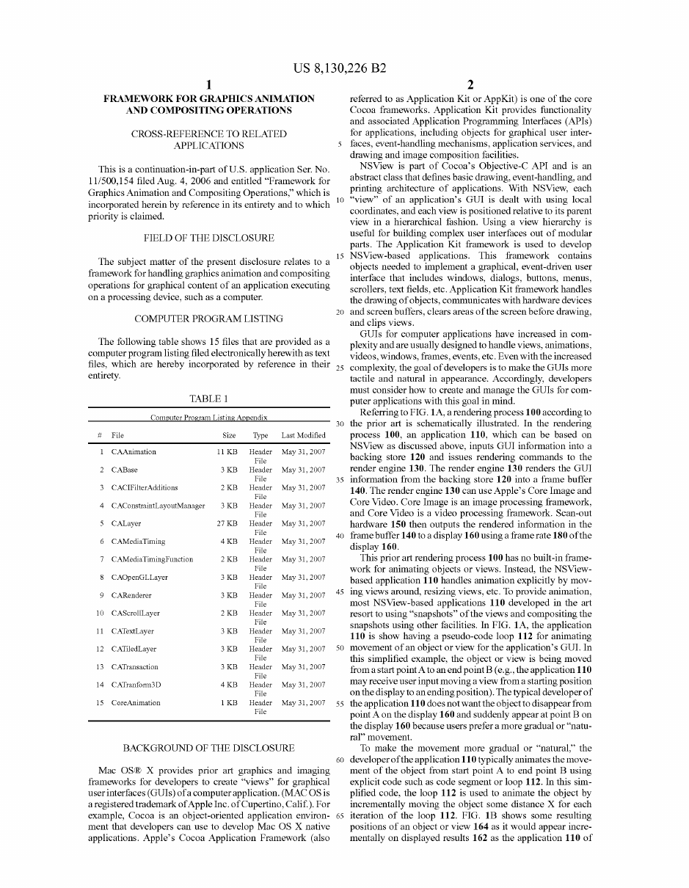

Figure 5D. Sheet 7 of 8. Schematically illustrates a hierarchy of classes, protocols, and other components of the illustrative framework. Layer classes 552 include CALayer as the parent class and subclasses such as CATextLayer, CAOpenGLLayer, CAScrollLayer, and QCCompositionLayer. Animation and timing classes 554 descend from CAAnimation and include CATransition, CAPropertyAnimation, CABasicAnimation, and CAKeyFrameAnimation. Layout Manager classes 556 include the CAConstraintLayoutManager and the CAConstraint objects that define geometrical relationships between sibling or superlayer geometric attributes. The transaction management class 558 is the CATransaction class used for batching atomic updates. Protocols shown include CATiming, CAAction, and NSKeyValueCoding (KVC).

---

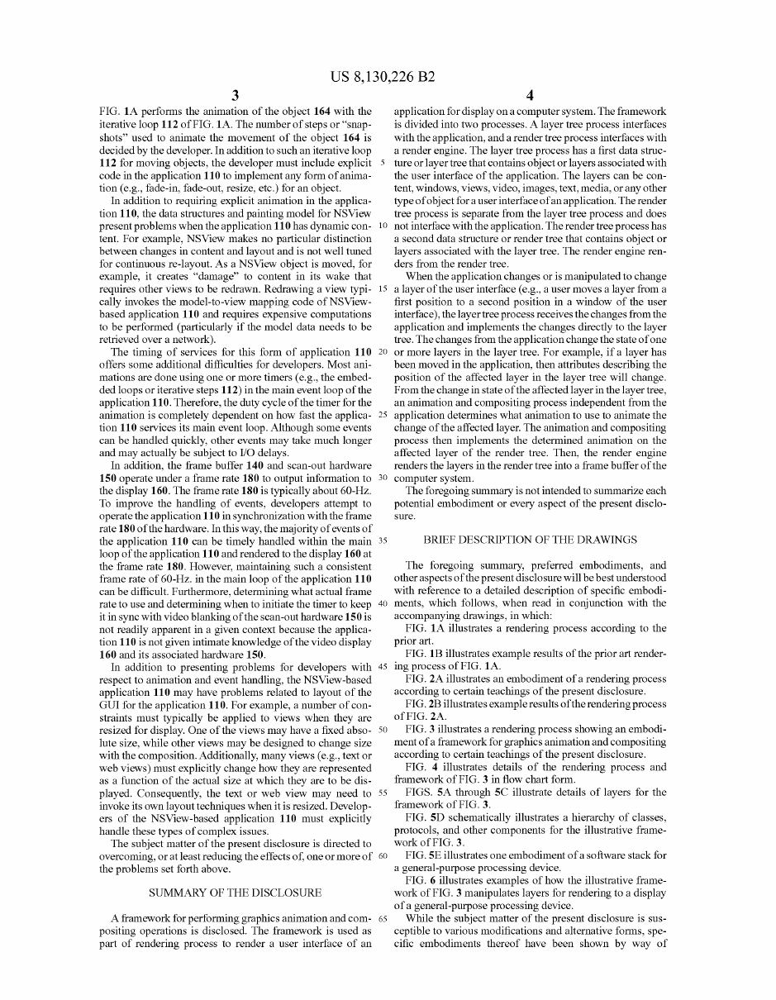

Figure 5E. Sheet 8 of 8. Illustrates one embodiment of a software stack 580 for a general-purpose processing device. The stack from bottom to top is: Operating System (O/S) kernel 582, O/S services 584, resources 586 (including OpenGL and similar graphics resources), the Core Animation framework 588, application frameworks and services 590 (such as Cocoa and QuickTime), and applications 592 at the top. Each level uses resources from below and provides services upward. Core Animation sits between the raw graphics resources and the higher-level application frameworks.

---

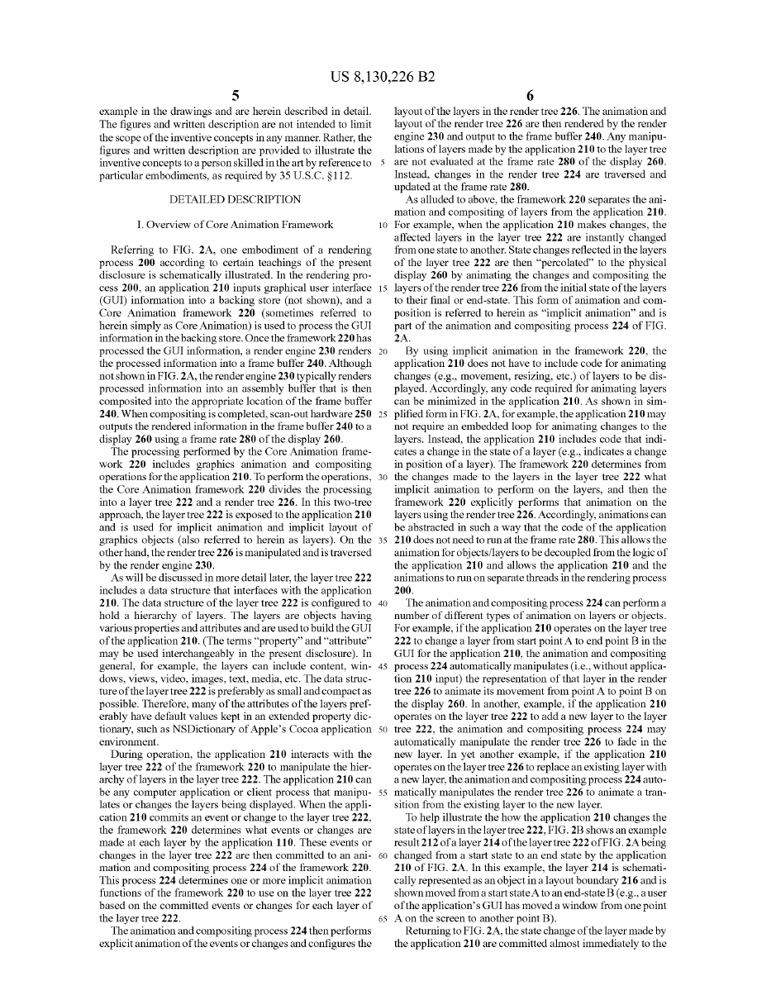

Figure 6. Sheet 8 of 8. Illustrates example operations of the Core Animation APIs 600 manipulating layers of an application 602. The figure depicts six numbered examples: example 610 animates a property of a layer such as increasing its border width; example 620 animates a transition of a layer (a circle moving in and being revealed from the bottom in a paced pattern); example 630 shows a basic animation scheme for interpolating between values in a single keyframe; example 640 shows a keyframe animation scheme spanning multiple keyframes; example 650 shows a transformation including translate, scale, rotate, warp, and fold operations; and example 660 shows scrolling a scrollable layer within a framing layer. Each example is controlled by directional information, timing information, and the other controls recited in the detailed description.

---

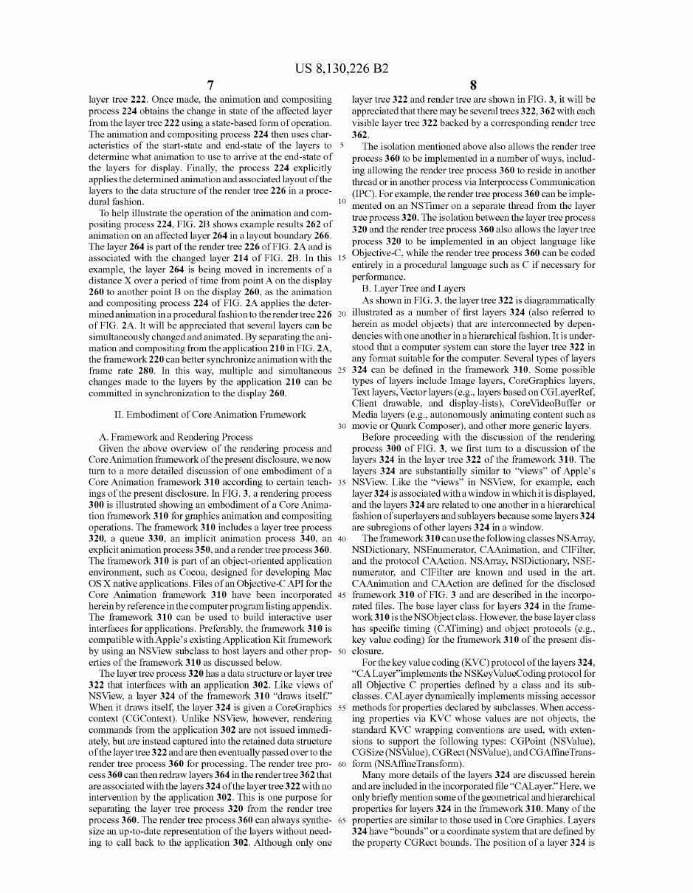

Specification, columns 1 and 2. The title line repeats "FRAMEWORK FOR GRAPHICS ANIMATION AND COMPOSITING OPERATIONS." The Cross-Reference to Related Applications identifies this as a continuation-in-part of Serial No. 11/500,154 filed August 4, 2006. The Field of the Disclosure is given as a framework for handling graphics animation and compositing operations for graphical content of an application executing on a processing device. The Computer Program Listing section lists Table 1 with the 15 files provided electronically: CAAnimation (11 KB header, May 31, 2007), CABase (3 KB), CACIFilterAdditions (2 KB), CAConstraintLayoutManager (3 KB), CALayer (27 KB), CAMediaTiming (4 KB), CAMediaTimingFunction (2 KB), CAOpenGLLayer (3 KB), CARenderer (3 KB), CAScrollLayer (2 KB), CATextLayer (3 KB), CATiledLayer (3 KB), CATransaction (3 KB), CATransform3D (4 KB), and CoreAnimation (1 KB). The Background of the Disclosure introduces Mac OS X, Cocoa, Application Kit (AppKit), and NSView, describing NSView as an abstract class defining basic drawing, event handling, and printing architecture. It describes how each view uses local coordinates, is positioned relative to its parent view, and how the Application Kit framework handles window and event-driven UI objects.

---

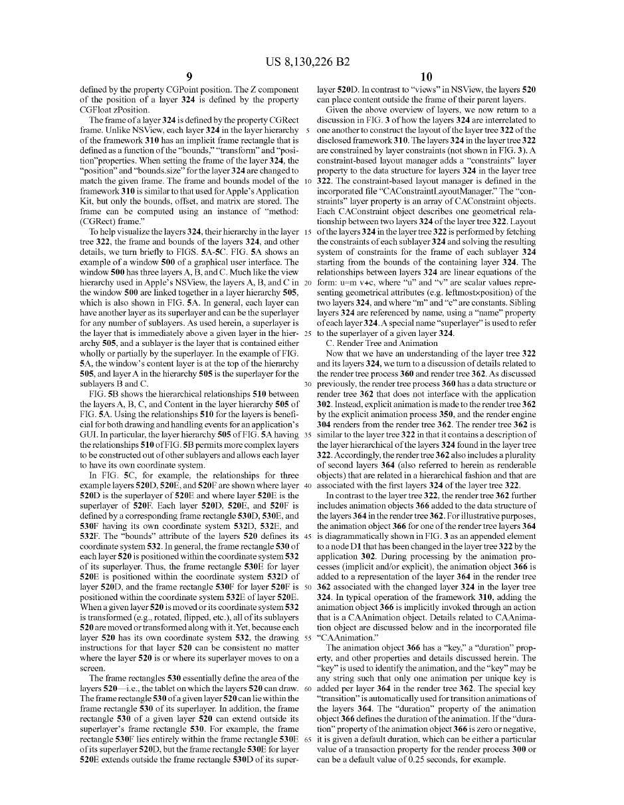

Specification, columns 3 and 4. The Background continues by describing the prior art rendering process 100 of Figure 1A in which an NSView-based application 110 inputs GUI information into a backing store 120 and issues rendering commands to render engine 130, which renders to frame buffer 140 and then scan-out hardware 150. The disclosure observes:

> "This prior art rendering process 100 has no built-in framework for animating objects or views. Instead, the NSView-based application 110 handles animation explicitly by moving views around, resizing views, etc."

It explains that most NSView-based applications resort to snapshots of views and composite them using other facilities, and that developers use embedded loops as in segment 112 to move objects from point A to point B. The specification continues by itemizing the additional problems with NSView-based animation: damage to content as views are moved, expensive redraws, dependency of timer duty cycle on how fast the application services its main event loop, and the difficulty of keeping application timers in sync with the 60 Hz display frame rate. A Summary of the Disclosure introduces the two-process framework split into a layer tree process interfacing with the application and a render tree process interfacing with the render engine.

---

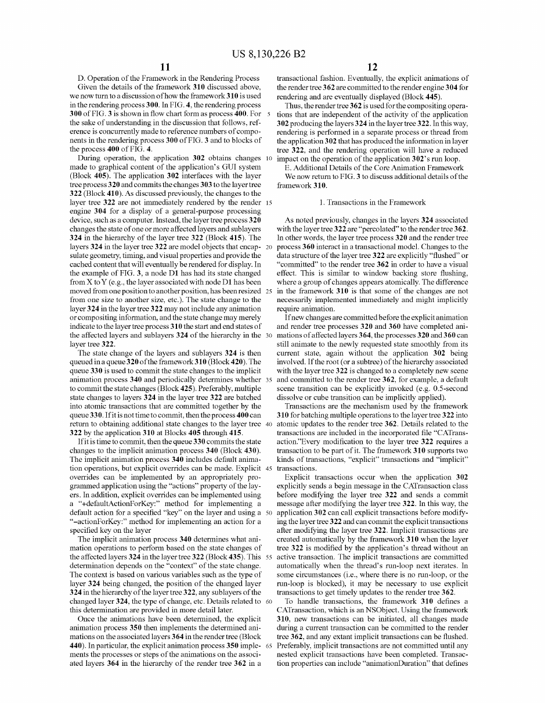

Specification, columns 5 and 6. The Brief Description of the Drawings enumerates Figures 1A through 6. The Detailed Description opens with Section I, Overview of Core Animation Framework, referring to Figure 2A. It describes how the application 210 inputs GUI information into a backing store and how the Core Animation framework 220 processes the information through a layer tree 222 and render tree 226, with the render engine 230 rendering into frame buffer 240 and scan-out hardware 250 driving display 260 at frame rate 280. The specification observes:

> "By using implicit animation in the framework 220, the application 210 does not have to include code for animating changes (e.g., movement, resizing, etc.) of layers to be displayed."

It introduces implicit animation as state-change driven, decoupling the application logic from the frame rate and allowing the application and animations to run on separate threads. Three representative animation cases are given: point-A-to-point-B motion, fading in a newly added layer, and transitioning between an existing and a new layer.

---

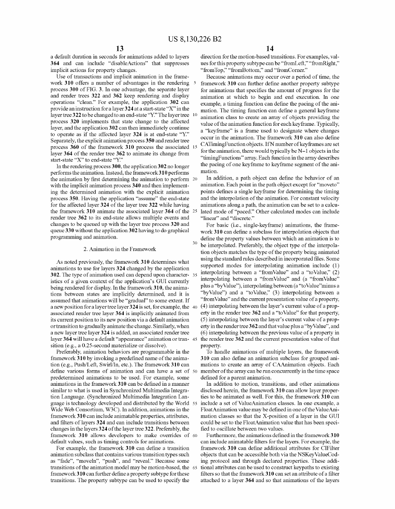

Specification, columns 7 and 8. Continues Section I with an explanation of the state-based acquisition of layer changes and the explicit animation application to the render tree. Section II begins with subsection A, Framework and Rendering Process, referring to Figure 3. It enumerates the components of framework 310: layer tree process 320, queue 330, implicit animation process 340, explicit animation process 350, and render tree process 360. It notes that the framework is compatible with Apple's existing Application Kit by using an NSView subclass to host layers. Subsection B, Layer Tree and Layers, describes the first layers 324 as model objects interconnected by hierarchical dependencies. It lists the types of layers: Image, CoreGraphics, Text, Vector (including CGLayerRef and display lists), CoreVideoBuffer, Media (such as Quartz Composer), and other generic layers. The framework uses classes NSArray, NSDictionary, NSEnumerator, CAAnimation, CIFilter, and the CAAction protocol. The base layer class for layers is NSObject, with specific CATiming timing and object protocols such as key value coding. The specification notes:

> "CALayer implements the NSKeyValueCoding protocol for all Objective-C properties defined by a class and its subclasses."

KVC wrapping extensions support CGPoint (NSValue), CGSize (NSValue), CGRect (NSValue), and CGAffineTransform (NSAffineTransform).

---

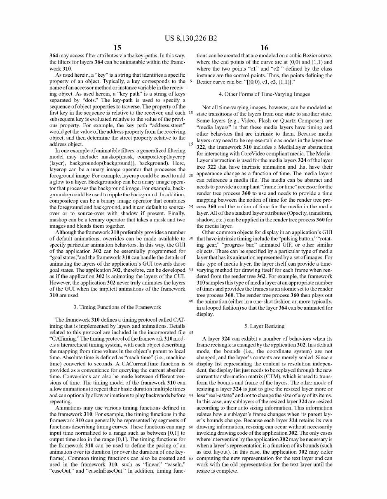

Specification, columns 9 and 10. Describes the geometry of CALayer. The position of a layer is defined by CGPoint position and the Z component by CGFloat zPosition. The frame of a layer is defined by CGRect frame, and unlike NSView, each layer in the framework's hierarchy has an implicit frame rectangle defined as a function of the bounds, transform, and position properties. It describes that the frame and bounds model is similar to Application Kit but only the bounds, offset, and matrix are stored, with frame computed via a method. It then walks through Figures 5A-5C, describing the window 500 with layers A, B, and C, the hierarchical relationships of superlayers and sublayers, and the three-layer frame rectangle example 520D/E/F with independent coordinate systems. The CAConstraintLayoutManager is described, specifying the layout relationship form "u = m v + c" between two layers, where u and v are geometrical attributes and m and c are constants, with the reserved name "superlayer" used to reference a parent. Subsection C, Render Tree and Animation, begins and describes the animation object 366 added to the data structure of the layers 364 in the render tree, with a key and duration property. The default duration is 0.25 seconds if zero or negative is given.

---

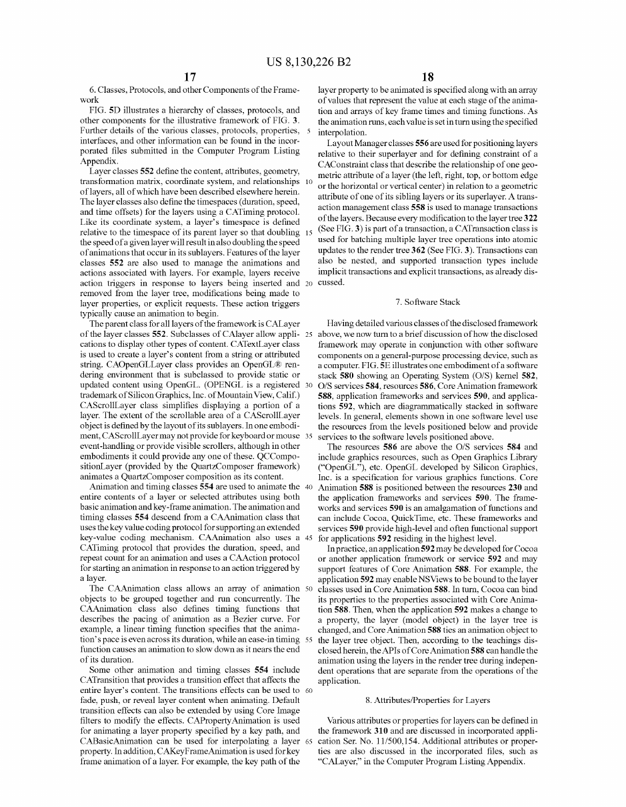

Specification, columns 11 and 12. Subsection D, Operation of the Framework in the Rendering Process, walks through the flow chart of Figure 4 with references to Figure 3 components. It reiterates the flow of obtaining application changes, committing them to the layer tree, queuing, committing batched atomic transactions, determining implicit animations, and explicitly animating the render tree layers before rendering by render engine 304. It observes:

> "The render tree 362 is used for the compositing operations that are independent of the activity of the application 302 producing the layers 324 in the layer tree 322."

Subsection E opens with Transactions in the Framework. It describes two kinds of transactions: explicit transactions bracketed by begin and commit messages on CATransaction, and implicit transactions created automatically when the layer tree is modified without an active transaction and committed on the next iteration of the thread's run loop. It notes transaction properties animationDuration (default duration in seconds for animations) and disableActions (suppresses implicit actions for property changes). Subsection 2, Animation in the Framework, begins by describing implicit animation as gradual by default and naming predefined animations such as Push/Left and Swirl/In. A transition animation subclass contains transition types "fade", "moveIn", "push", and "reveal", with motion-based transitions having a property subtype specifying direction: "fromLeft", "fromRight", "fromTop", "fromBottom", and "fromCorner".

---

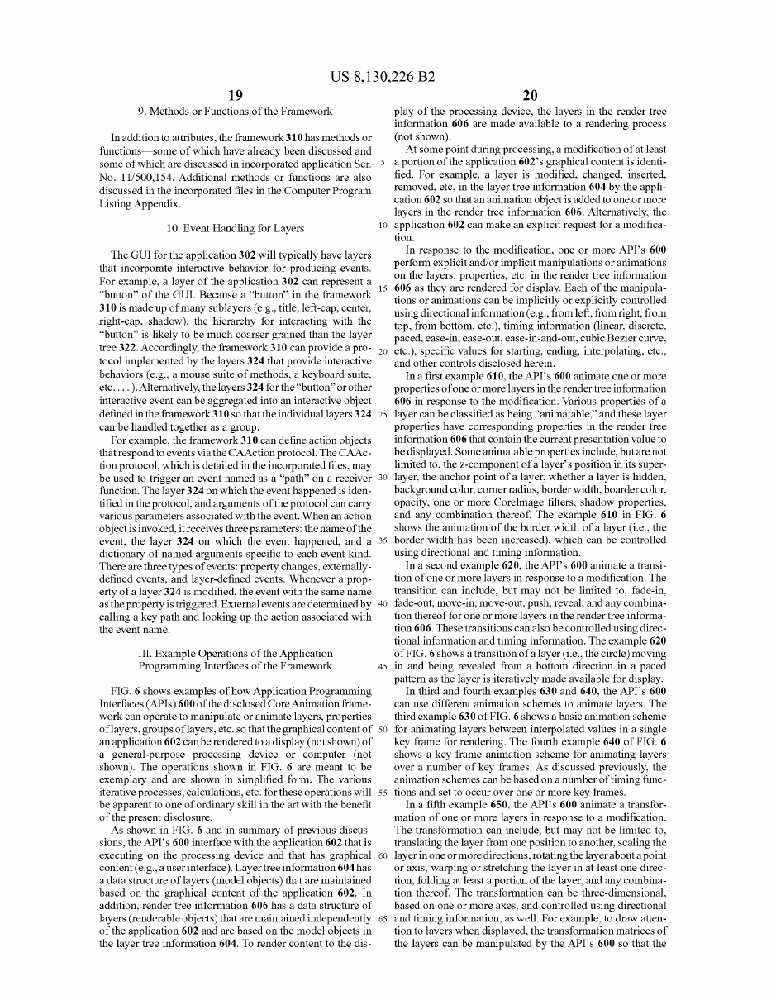

Specification, columns 13 and 14. Continues Section 2 with timing functions. The framework defines CATimingFunction objects and describes keyframe animation where if N keyframes are set there would typically be N-1 objects in the timingFunctions array. A path object can define animation behavior, with non-moveto path points defining keyframes; calculated modes include "paced", "linear", and "discrete". Supported interpolation modes for basic single-keyframe animations are enumerated: between a fromValue and a toValue; between a fromValue and (fromValue plus byValue); between (toValue minus byValue) and a toValue; between a fromValue and the current presentation value; between the layer's current render tree value and a toValue; between the layer's current value and that value plus a byValue; and between the previous value and the current presentation value. Grouped animations via a CAAnimation array subclass allow concurrent animations in the parent animation's time space. ValueAnimation classes including FloatAnimation allow properties such as X-position to oscillate between two values. Animatable CIFilter attributes allow filter keypaths to be set so animations can access filter attributes.

---

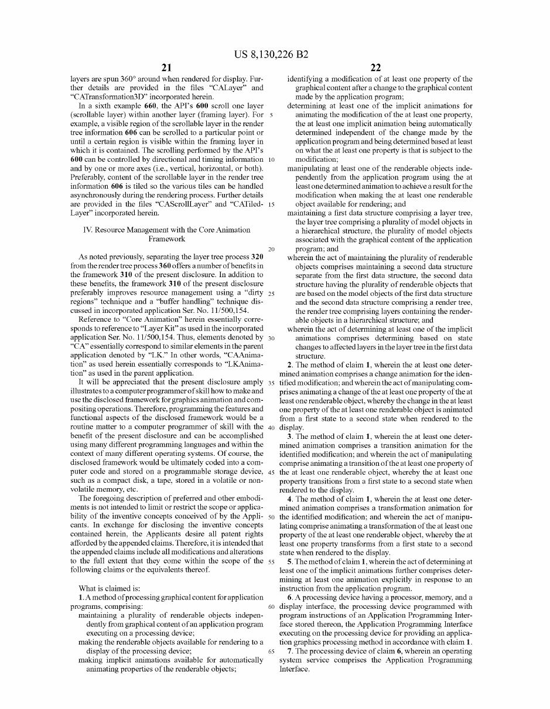

Specification, columns 15 and 16. Defines "key" as a string that identifies a specific property of an object, and "key path" as a string of keys separated by dots. Example: the key path "address.street" gets the address property from the receiver, then determines the street property relative to the address object. A generalized filtering model is expressed as:

> "maskop(mask, compositeop(layerop(layer), backgroundop(background)), background)"

where layerop is a unary operator on foreground, backgroundop is a unary operator on background, compositeop defaults to source-over or source-over-with-shadow, and maskop is a ternary operator blending two images through a mask. Subsection 3, Timing Functions of the Framework, describes the CATiming protocol and absolute time as mach time converted to seconds, with CACurrentTime as a convenience function. Standard timing functions "linear", "easeIn", "easeOut", and "easeInEaseOut" are listed, modeled on cubic Bezier curves with endpoints (0,0) and (1,1) and control points c1 and c2. Subsection 4, Other Forms of Time-Varying Images, introduces the MediaLayer abstraction for interacting with CoreVideo-compliant media such as video, Flash, and Quartz Composer, noting that media layers have intrinsic timing. Subsection 5, Layer Resizing, describes the default mode where bounds are unchanged and content is scaled using the current transformation matrix, versus a resize mode that gives more or less real estate without changing sublayer sizes.

---

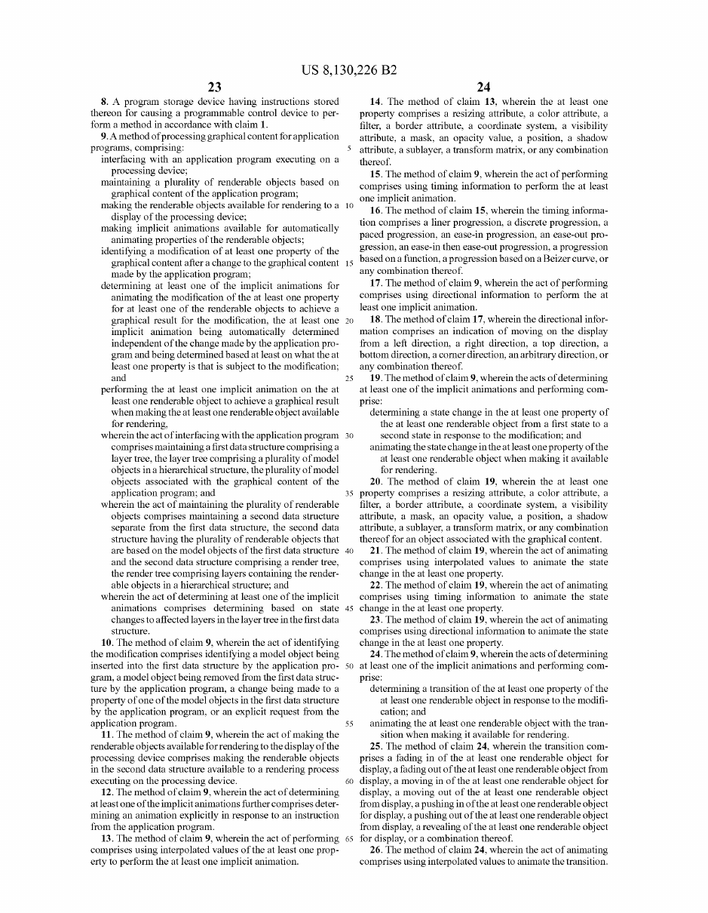

Specification, columns 17 and 18. Subsection 6, Classes, Protocols, and other Components of the Framework, references Figure 5D and describes the layer classes 552 (CALayer, CATextLayer, CAOpenGLLayer, CAScrollLayer, QCCompositionLayer), animation and timing classes 554 (CAAnimation, CATransition, CAPropertyAnimation, CABasicAnimation, CAKeyFrameAnimation), layout manager classes 556 (CAConstraintLayoutManager, CAConstraint), and transaction management class 558 (CATransaction). Subsection 7, Software Stack, references Figure 5E and places Core Animation 588 between resources 586 (OpenGL and similar) and application frameworks and services 590 (Cocoa, QuickTime), with applications 592 at the top. Subsection 8, Attributes/Properties for Layers, and Subsection 9, Methods or Functions of the Framework, refer the reader to the incorporated parent application 11/500,154 and the header files in the Computer Program Listing Appendix. Subsection 10, Event Handling for Layers, describes that layers incorporate interactive behavior via the CAAction protocol. A button-style layer is made of many sublayers (title, left-cap, center, right-cap, shadow) that are aggregated into an interactive object. Three types of events are named: property changes, externally defined events, and layer-defined events.

---

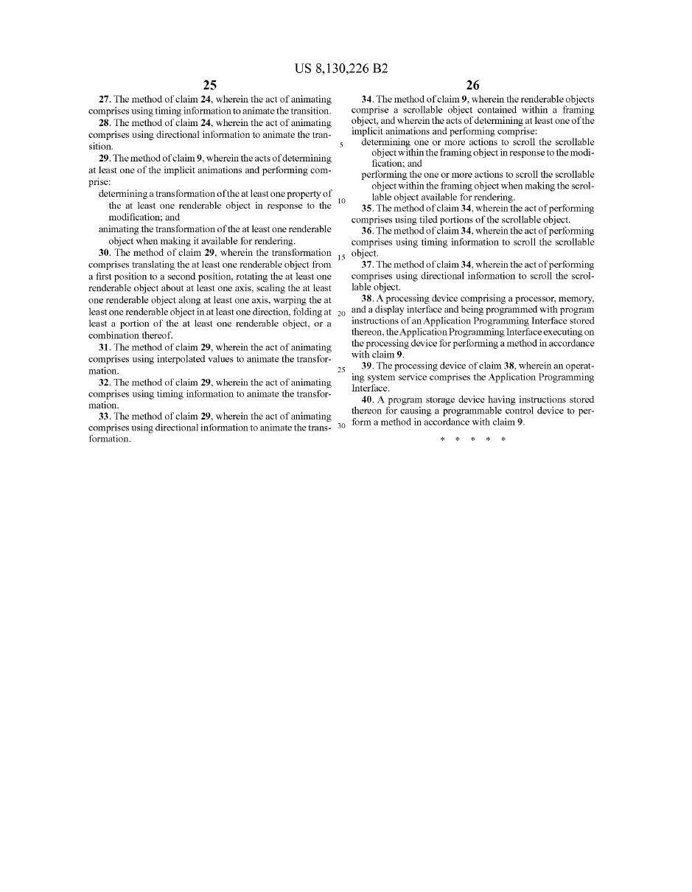

Specification, columns 19 and 20, and claims. Section III, Example Operations of the Application Programming Interfaces of the Framework, walks through Figure 6, describing animatable properties including z-component of position, anchor point, hidden, background color, corner radius, border width, border color, opacity, one or more CoreImage filters, and shadow properties. The six numbered examples 610, 620, 630, 640, 650, and 660 are described covering property animation, transition animation, basic animation scheme, keyframe animation scheme, transformation animation (translate, scale, rotate, warp, fold), and scrollable layer within a framing layer. Section IV, Resource Management with the Core Animation Framework, refers to dirty regions and buffer handling techniques from the incorporated parent application 11/500,154 and notes that:

> "Reference to 'Core Animation' herein essentially corresponds to reference to 'Layer Kit' as used in the incorporated application Ser. No. 11/500,154."

Thus "CAAnimation" as used herein essentially corresponds to "LKAnimation" in the parent application.

The claims section begins. Claim 1 recites:

> "A method of processing graphical content for application programs, comprising: maintaining a plurality of renderable objects independently from graphical content of an application program executing on a processing device; making the renderable objects available for rendering to a display of the processing device; making implicit animations available for automatically animating properties of the renderable objects; identifying a modification of at least one property of the graphical content after a change to the graphical content made by the application program; determining at least one of the implicit animations for animating the modification of the at least one property, the at least one implicit animation being automatically determined independent of the change made by the application program and being determined based at least on what the at least one property is that is subject to the modification; manipulating at least one of the renderable objects independently from the application program using the at least one determined animation to achieve a result for the modification when making the at least one renderable object available for rendering; and maintaining a first data structure comprising a layer tree, the layer tree comprising a plurality of model objects in a hierarchical structure, the plurality of model objects associated with the graphical content of the application program; and wherein the act of maintaining the plurality of renderable objects comprises maintaining a second data structure separate from the first data structure, the second data structure having the plurality of renderable objects that are based on the model objects of the first data structure and the second data structure comprising a render tree, the render tree comprising layers containing the renderable objects in a hierarchical structure; and wherein the act of determining at least one of the implicit animations comprises determining based on state changes to affected layers in the layer tree in the first data structure."

Claim 2 narrows Claim 1 so that the determined animation comprises a change animation and the act of manipulating comprises animating a change of the at least one property of the at least one renderable object from a first state to a second state when rendered.

Claim 3 narrows Claim 1 so that the determined animation comprises a transition animation and manipulating animates a transition of the property from a first state to a second state.

Claim 4 narrows Claim 1 so that the determined animation comprises a transformation animation and manipulating animates a transformation of the property from a first state to a second state.

Claim 5 adds to Claim 1 the step of determining at least one animation explicitly in response to an instruction from the application program.

Claim 6 recites a processing device having a processor, memory, and a display interface programmed with an Application Programming Interface that executes the method of Claim 1.

Claim 7 narrows Claim 6 so that an operating system service comprises the Application Programming Interface.

Claim 8 recites a program storage device having instructions stored thereon for causing a programmable control device to perform the method of Claim 1.

Claim 9 is an independent method claim parallel to Claim 1 that recites interfacing with an application, maintaining renderable objects, making implicit animations available, identifying a modification, determining at least one implicit animation independent of the application change based on the property subject to modification, and performing the at least one implicit animation on the renderable object. Claim 9 similarly requires a first data structure comprising a layer tree of model objects and a second data structure separate from the first comprising a render tree of renderable objects, with determination based on state changes to affected layers in the layer tree.

Claim 10 narrows Claim 9 by enumerating what identifying the modification comprises: a model object being inserted, removed, a change being made to a property of a model object, or an explicit request.

Claim 11 narrows Claim 9 by making the renderable objects of the second data structure available to a rendering process executing on the processing device.

Claim 12 adds explicit animation in response to an instruction from the application program to Claim 9.

Claim 13 adds that performing comprises using interpolated values of the property to perform the at least one implicit animation.

Claim 14 enumerates animatable properties as resizing attribute, color attribute, filter, border attribute, coordinate system, visibility attribute, mask, opacity value, position, shadow attribute, sublayer, transform matrix, or any combination.

Claim 15 adds that performing comprises using timing information.

Claim 16 enumerates timing information as linear progression, discrete progression, paced progression, ease-in progression, ease-out progression, ease-in then ease-out progression, a progression based on a function, a progression based on a Bezier curve, or any combination.

Claim 17 adds that performing comprises using directional information.

Claim 18 enumerates directional information as moving from a left direction, right direction, top direction, bottom direction, corner direction, arbitrary direction, or any combination.

Claim 19 adds determining a state change in the property from a first state to a second state in response to the modification and animating the state change when making the renderable object available for rendering.

Claim 20 enumerates state-change animatable properties (resizing attribute, color attribute, filter, border attribute, coordinate system, visibility attribute, mask, opacity value, position, shadow attribute, sublayer, transform matrix, or any combination).

Claim 21 adds that animating the state change comprises using interpolated values.

Claim 22 adds that animating comprises using timing information.

Claim 23 adds that animating comprises using directional information.

Claim 24 adds determining a transition of the property and animating the renderable object with the transition.

Claim 25 enumerates transitions (fading in, fading out, moving in, moving out, pushing in, pushing out, revealing, or a combination).

Claim 26 adds that animating the transition comprises using interpolated values.

Claim 27 adds that animating the transition comprises using timing information.

Claim 28 adds that animating the transition comprises using directional information.

Claim 29 adds determining a transformation of the property and animating the transformation of the renderable object.

Claim 30 enumerates transformations (translating from a first to a second position, rotating about at least one axis, scaling along at least one axis, warping in at least one direction, folding at least a portion of the renderable object, or a combination).

Claim 31 adds that animating the transformation uses interpolated values.

Claim 32 adds that animating the transformation uses timing information.

Claim 33 adds that animating the transformation uses directional information.

Claim 34 adds that the renderable objects comprise a scrollable object contained within a framing object and recites determining actions to scroll the scrollable object within the framing object and performing the actions when making the scrollable object available for rendering.

Claim 35 adds that performing comprises using tiled portions of the scrollable object.

Claim 36 adds that performing comprises using timing information to scroll the scrollable object.

Claim 37 adds that performing comprises using directional information to scroll the scrollable object.

Claim 38 recites a processing device comprising a processor, memory, and display interface programmed with an Application Programming Interface that performs the method of Claim 9.

Claim 39 narrows Claim 38 so that an operating system service comprises the Application Programming Interface.

Claim 40 recites a program storage device having instructions stored thereon for causing a programmable control device to perform the method of Claim 9.

The patent concludes with the standard "* * * * *" terminator.
