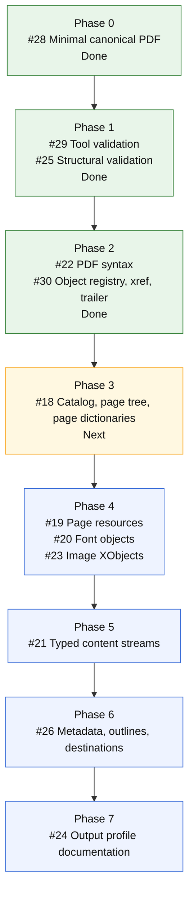

# MarkdownPDF

MarkdownPDF is a Pure Swift Markdown to PDF renderer. It parses Markdown, lays it
out, and writes PDF bytes directly in Swift. It does not use PDFKit,
CoreGraphics, WebKit, wkhtmltopdf, Chromium, LaTeX, or C Markdown/PDF libraries.

The package is designed to build on macOS and Linux. The default font set uses
standard PDF base fonts for portable text layout without embedding font files.
Apple system font names remain available through `PDFOptions.FontSet.appleSystem`.

## Status

Early implementation. The compatibility target is CommonMark plus GitHub
Flavored Markdown tables and images. The first renderer currently covers
headings, paragraphs, emphasis, strong text, strike-through, inline code, links,
local JPEG and PNG images, block quotes, ordered and unordered lists, fenced
code blocks, thematic breaks, raw HTML as visible text, and tables.

The resume and CV template is separate from the generic renderer. It lives in
the `MarkdownPDFResume` target and emits Markdown from structured resume JSON.
The `resumepdf` executable combines that template with the generic renderer.

The package also exposes platform entry products. `MarkdownPDFLinux` is the
portable renderer entry point for Linux-compatible generation.
`MarkdownPDFMac` is a macOS-only entry point reserved for a future native macOS
backend; it currently delegates to the portable renderer.

See [docs/DESIGN.md](docs/DESIGN.md) for the architecture.

## Canonical PDF roadmap

Epic [#27](https://github.com/mihaelamj/MarkdownPDF/issues/27) tracks the
ordered path from the current byte writer to a fully typed canonical PDF
document structure.



## Use

```swift
import MarkdownPDF

let markdown = "# Hello\n\nA small PDF renderer."
let data = try MarkdownPDFRenderer().render(markdown: markdown)
try data.write(to: URL(fileURLWithPath: "hello.pdf"))
```

Portable Linux-facing product:

```swift
import MarkdownPDFLinux

let data = try MarkdownPDFLinuxRenderer().render(markdown: markdown)
```

macOS-facing product:

```swift
import MarkdownPDFMac

let data = try MarkdownPDFMacRenderer().render(markdown: markdown)
```

Command line:

```sh
cd Packages
swift run markdownpdf input.md output.pdf
```

Resume template command line:

```sh
cd Packages
swift run resumepdf input.json output.pdf
```

See [docs/RESUME_TEMPLATE.md](docs/RESUME_TEMPLATE.md) for the template and
journal inputs behind it.

## Build

```sh
cd Packages
swift build
swift test
```

## Design constraints

- Pure Swift source.
- No runtime shell-out to another renderer.
- No font embedding in the public repo.
- Standard PDF base fonts by default, with Apple system font names available
  through `PDFOptions.FontSet.appleSystem`.
- Linux generation support through Foundation and byte-level PDF serialization.

## License

See [LICENSE](LICENSE).
