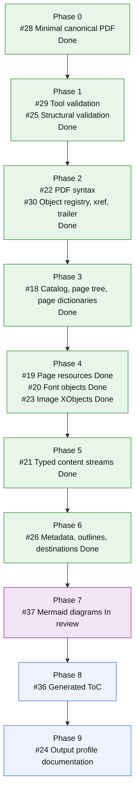

# MarkdownPDF

**Follow updates on [@diyamantina](https://x.com/diyamantina).**

[](https://github.com/mihaelamj/MarkdownPDF/actions/workflows/style.yml)
[](https://github.com/mihaelamj/MarkdownPDF/actions/workflows/swift-macos.yml)
[](https://github.com/mihaelamj/MarkdownPDF/actions/workflows/swift-linux.yml)

MarkdownPDF is a Pure Swift Markdown to PDF renderer. It parses Markdown, lays
the document out, and serializes PDF bytes directly in Swift.

The core renderer is built for macOS and Linux. It does not use PDFKit,
CoreGraphics, WebKit, wkhtmltopdf, Chromium, LaTeX, browser renderers,
JavaScript, Python, shell renderers, or C Markdown/PDF libraries.

## What Works Today

MarkdownPDF is early, but it already emits inspectable PDF 1.4 files with
deterministic object order, xref offsets, trailer data, page resources, metadata,
heading destinations, outlines, link annotations, text, and image XObjects.

The generic renderer currently covers:

- Headings, paragraphs, block quotes, thematic breaks, and raw HTML as visible
  text.
- Emphasis, strong text, strike-through, inline code, links, and backslash
  escapes.
- Ordered lists, unordered lists, fenced code blocks, and GitHub-flavored tables.
- Local JPEG and PNG images resolved relative to the input document.
- PDF document title metadata, heading outlines, and internal heading links.
- Standard PDF base fonts by default, without embedding font files.

The compatibility target is CommonMark plus GitHub Flavored Markdown tables and
images. The generated profile is still intentionally small while the canonical
PDF structure is being moved into typed Swift components.

## Package Products

| Product | Kind | Purpose |
|---|---|---|
| `MarkdownPDF` | Library | Portable Markdown parser, layout engine, and direct PDF byte writer. |
| `MarkdownPDFLinux` | Library | Linux-facing entry point for the portable renderer. |
| `MarkdownPDFMac` | Library | macOS-only entry point. It currently delegates to the portable renderer. |
| `MarkdownPDFResume` | Library | Structured resume JSON to Markdown template. |
| `markdownpdf` | Executable | Markdown file to PDF file command. |
| `resumepdf` | Executable | Resume JSON file to PDF file command. |

`MarkdownPDFMac` is available only when the package is built on macOS. iOS
support is not claimed.

## Quick Start

Use the portable renderer directly:

```swift
import Foundation
import MarkdownPDF

let markdown = "# Hello\n\nA small PDF renderer."
let data = try MarkdownPDFRenderer().render(markdown: markdown)
try data.write(to: URL(fileURLWithPath: "hello.pdf"))
```

Use custom page settings:

```swift
import MarkdownPDF

let options = PDFOptions(
    pageSize: .letter,
    margins: PDFOptions.Margins(top: 48, right: 48, bottom: 48, left: 48),
    baseFontSize: 11,
    fontSet: .pdfBase,
    title: "Example",
)

let markdown = "# Letter Page\n\nCustom page settings."
let data = try MarkdownPDFRenderer(options: options).render(markdown: markdown)
```

Use the Linux-facing product:

```swift
import MarkdownPDFLinux

let markdown = "# Linux\n\nPortable PDF output."
let data = try MarkdownPDFLinuxRenderer().render(markdown: markdown)
```

Use the macOS-facing product:

```swift
import MarkdownPDFMac

let markdown = "# macOS\n\nCurrently delegates to the portable renderer."
let data = try MarkdownPDFMacRenderer().render(markdown: markdown)
```

Run the Markdown CLI:

```sh
cd Packages
swift run markdownpdf input.md output.pdf
```

Run the resume template CLI:

```sh
cd Packages
swift run resumepdf input.json output.pdf
```

See [docs/RESUME_TEMPLATE.md](docs/RESUME_TEMPLATE.md) for the resume JSON
shape and journal inputs behind it.

## Canonical PDF roadmap

Epic [#27](https://github.com/mihaelamj/MarkdownPDF/issues/27) tracks the
ordered path from the current byte writer to a fully typed canonical PDF
document structure.

Portable Mermaid diagrams and generated ToC are explicit phases because they
affect pagination and must work on Linux without Node or Apple-only rendering.
The epic issue and this diagram should be updated at every child issue transition:
implementation start, PR open, merge, or scope change.



## Validation

The test suite validates generated PDFs in five layers:

- Swift structural inspection checks object references, xref offsets, stream
  lengths, page resources, annotations, fonts, images, and canonical page
  structure.
- `qpdf --check` validates syntax, xref, trailer, and stream-level structure.
- Poppler tools inspect reader behavior through `pdfinfo`, `pdftotext`,
  `pdftotext -tsv`, and `pdftoppm`.
- MuPDF `mutool` independently extracts character quads and renders page
  rasters.
- Poppler and MuPDF raster output is compared across every generated page in the
  visual stress fixture.

Layout-affecting renderer changes must keep the visual geometry tests passing.
Those tests render representative multi-page Markdown with dense prose, inline
styles, lists, tables, links, fenced code fallback, Mermaid diagrams, and page
breaks. They extract Poppler word and line boxes with `pdftotext -tsv`, extract
MuPDF character quads with `mutool draw -F stext`, and compare Poppler and MuPDF
raster ink bounds for every page. They fail on non-positive boxes, text outside
page bounds, same-line word overlap, same-word glyph overlap, vertical line
collisions, blank renders, or divergent ink bounds.

Witness differences are handled in the test layer unless the generated PDF bytes
truly need to differ by platform. Linux Poppler page-origin normalization and
macOS CI Base35 font installation are examples of witness environment fixes, not
production renderer forks.

See [docs/research/pdf-validation-tooling.md](docs/research/pdf-validation-tooling.md)
and [docs/research/pdf-visual-layout-validation.md](docs/research/pdf-visual-layout-validation.md)
for the validation rationale. See
[docs/rules/pdf-witness-gate.md](docs/rules/pdf-witness-gate.md) for the policy
future PDF features must satisfy.

## Build and Test

```sh
cd Packages
swift build
swift test
```

The same package is expected to build on macOS and Linux. GitHub CI runs style,
macOS Swift, and Linux Swift checks.

Useful local checks from the repository root:

```sh
./scripts/check-style.sh
swiftformat . --config .swiftformat --lint
swiftlint --config .swiftlint.yml
```

## Documentation

- [CONTRIBUTING.md](CONTRIBUTING.md): contributor setup, conventions, branches,
  commits, and pull requests.
- [CODE_OF_CONDUCT.md](CODE_OF_CONDUCT.md): community standards and enforcement.
- [docs/DESIGN.md](docs/DESIGN.md): implementation architecture.
- [docs/CONVENTIONS.md](docs/CONVENTIONS.md): project conventions.
- [docs/RESUME_TEMPLATE.md](docs/RESUME_TEMPLATE.md): resume JSON and template
  behavior.
- [docs/research/README.md](docs/research/README.md): research map.
- [docs/research/canonical-pdf-document-structure.md](docs/research/canonical-pdf-document-structure.md):
  canonical PDF structure notes.
- [docs/research/markdownpdf-output-profile.md](docs/research/markdownpdf-output-profile.md):
  target output profile.

## Platform Boundaries

- Portable behavior means macOS and Linux.
- `MarkdownPDFMac` is a macOS target hook, not a separate backend yet.
- iOS support is not implemented or tested.
- Apple system font names remain available through
  `PDFOptions.FontSet.appleSystem`, but the public repo does not embed font
  files.
- Research source snapshots, when present, are evidence only. They are not
  package dependencies. See
  [docs/research/source-snapshot-policy.md](docs/research/source-snapshot-policy.md).

## Design Constraints

- Pure Swift source.
- Direct PDF byte generation.
- No runtime shell-out to another renderer or validator during rendering.
- No PDFKit, CoreGraphics, WebKit, browser renderers, LaTeX, JavaScript, Python,
  shell renderers, or C Markdown/PDF libraries in implementation.
- No embedded font files in the public repo.
- Standard PDF base fonts by default, with Apple system font names available
  through `PDFOptions.FontSet.appleSystem`.
- Linux generation support through Foundation and byte-level PDF serialization.
- Small, testable public API.

## License

See [LICENSE](LICENSE).
