# MarkdownPDF

**Follow updates on [@diyamantina](https://x.com/diyamantina).**

[](https://github.com/mihaelamj/MarkdownPDF/actions/workflows/style.yml)
[](https://github.com/mihaelamj/MarkdownPDF/actions/workflows/swift-macos.yml)
[](https://github.com/mihaelamj/MarkdownPDF/actions/workflows/swift-linux.yml)

MarkdownPDF is a Pure Swift Markdown to PDF renderer. It parses Markdown, lays
the document out, and serializes PDF bytes directly in Swift.

The core renderer is built for macOS and Linux. It does not use PDFKit,
CoreGraphics, WebKit, wkhtmltopdf, Chromium, LaTeX, browser renderers,
JavaScript, Python, shell renderers, or C Markdown/PDF libraries.

<p align="center">
  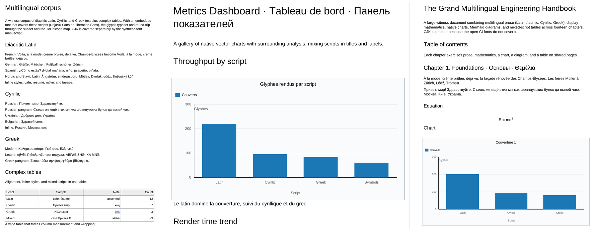
</p>

## Gallery

Real PDF pages produced by MarkdownPDF, rendered here as images. Output is
deterministic: the same Markdown produces the same geometry on macOS, Linux, and
iOS, and embedded fonts travel inside the file so every viewer draws the same
glyphs. Each page is validated by a Poppler + MuPDF witness battery.

<table>
  <tr>
    <td width="50%" valign="top">
      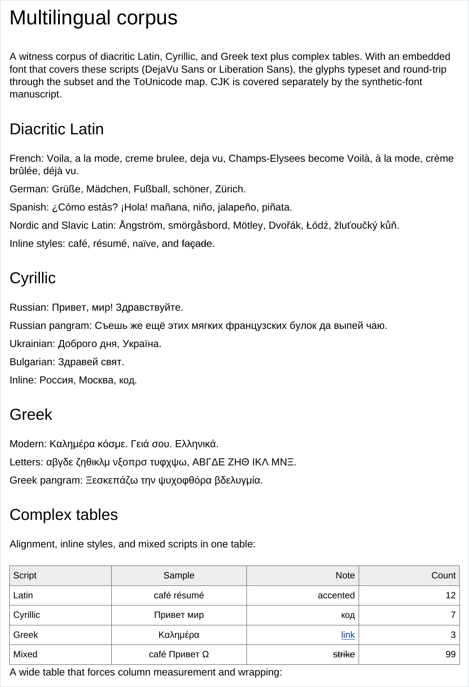<br>
      <sub><b>Multilingual text</b>: diacritic Latin, Cyrillic, and Greek with embedded TrueType fonts and correct width scaling.</sub>
    </td>
    <td width="50%" valign="top">
      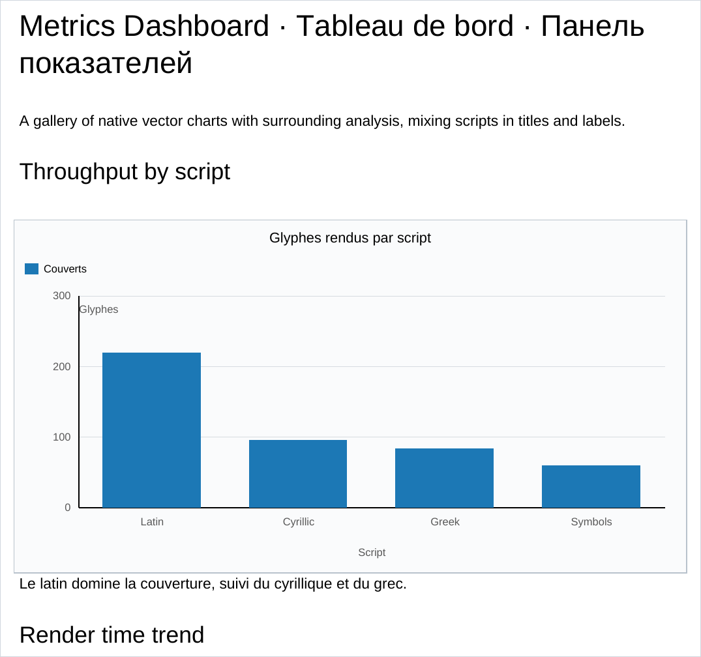<br>
      <sub><b>Native vector charts</b>: bar, line, and pie drawn with PDF path operators, not rasterized images.</sub>
    </td>
  </tr>
  <tr>
    <td valign="top">
      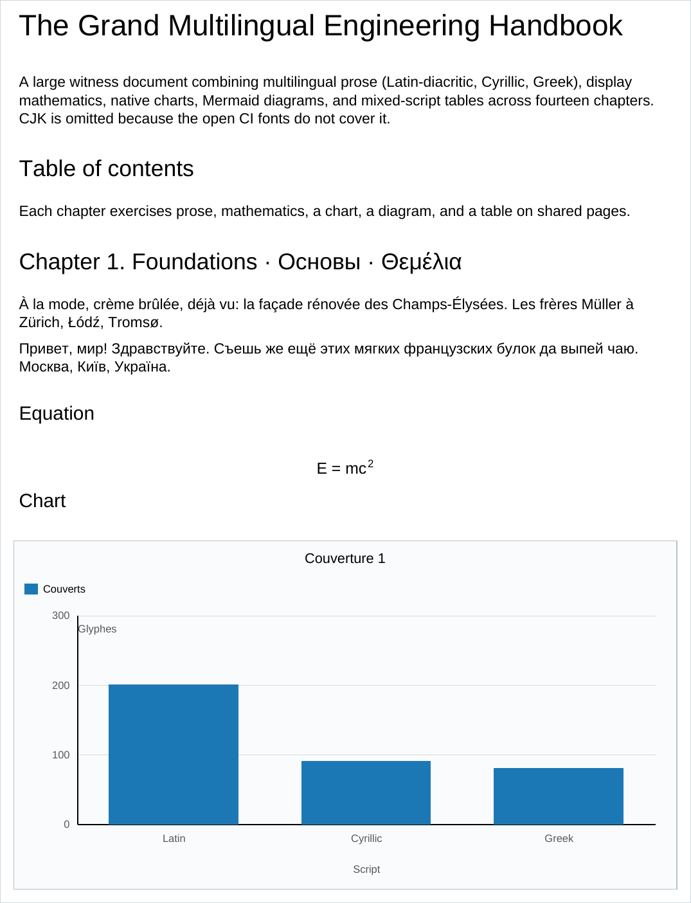<br>
      <sub><b>Mixed content</b>: prose, TeX math, charts, Mermaid diagrams, and tables on shared pages.</sub>
    </td>
    <td valign="top">
      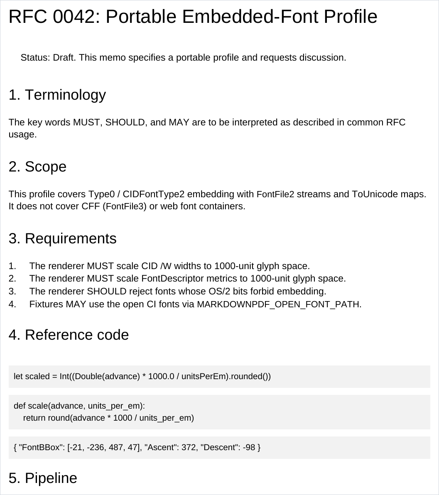<br>
      <sub><b>Code and specs</b>: fenced code blocks across languages, tables, and a portable Mermaid subset.</sub>
    </td>
  </tr>
  <tr>
    <td valign="top">
      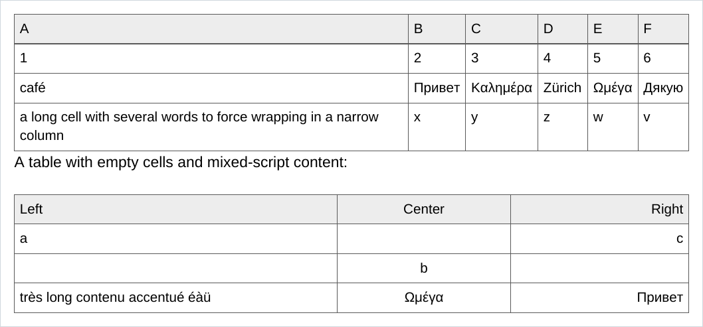<br>
      <sub><b>Mixed-script tables</b>: alignment, column measurement, wrapping, and empty cells across scripts.</sub>
    </td>
    <td valign="top">
      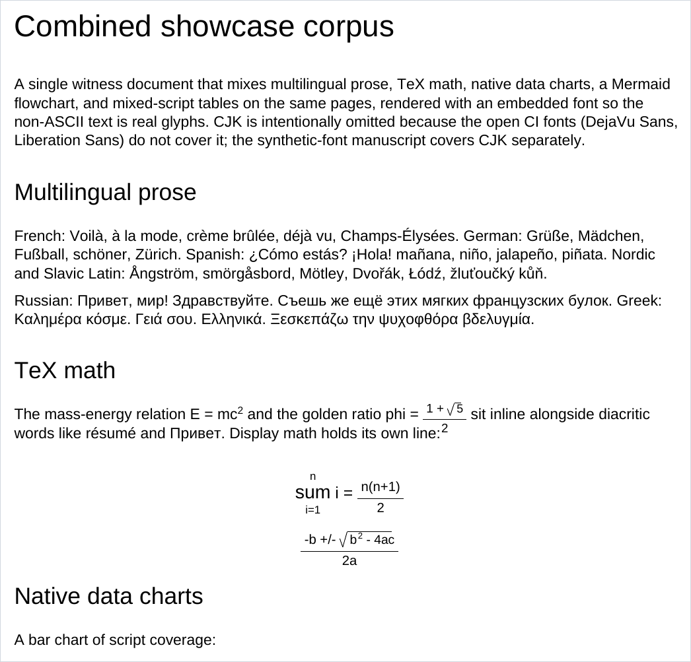<br>
      <sub><b>Everything at once</b>: multilingual prose, display math with scaling radicals, and charts in one document.</sub>
    </td>
  </tr>
</table>

## What Works Today

MarkdownPDF is early, but it already emits inspectable PDF 1.4 files with
deterministic object order, xref offsets, trailer data, page resources, metadata,
heading destinations, outlines, link annotations, text, and image XObjects.

The generic renderer currently covers:

- Headings, paragraphs, block quotes, thematic breaks, and raw HTML as visible
  text.
- Emphasis, strong text, strike-through, inline code, links, and backslash
  escapes.
- Ordered lists, unordered lists, fenced code blocks, and GitHub-flavored tables.
- Local JPEG and PNG images resolved relative to the input document.
- PDF document title metadata, heading outlines, and internal heading links.
- Opt-in generated table of contents with final page numbers and internal links.
- Standard PDF base fonts by default, without embedding font files.
- Opt-in embedded TrueType font data through `PDFOptions.EmbeddedFonts`, using
  Type 0 / CIDFontType2 fonts, ToUnicode maps, and subsetted FontFile2 streams.
- Opt-in portable syntax coloring for supported fenced code-block language
  hints, using direct DeviceRGB text operators.
- Configurable `PDFOptions.Theme` styling with built-in default, dark, and print
  themes plus a code-syntax color surface.
- Opt-in TeX-style math parsing through `PDFOptions.MathTypesetting`, with a
  Pure Swift subset for inline math, display math, scripts, fractions, scaling
  stroke radicals, fixed delimiters, symbols, extraction text, and visible
  fallback for unsupported commands. The math engine lives in the shared,
  dependency-free [MathTypeset](https://github.com/mihaelamj/MathTypeset)
  package. `PDFOptions.MathTypesetting.fontBacked` additionally requires the
  styled math role to use an embedded OpenType font with a `MATH` table.
- Opt-in Pure Swift `/FlateDecode` compression for page content streams and
  embedded FontFile2 streams when the encoded bytes are smaller than raw bytes.
- Opt-in tagged PDF structure output with `/MarkInfo`, `/StructTreeRoot`,
  `/ParentTree`, page `/StructParents`, and marked-content IDs.
- Opt-in PDF/UA-1 and PDF/A-2a conformance profiles through
  `PDFOptions.Conformance.pdfUA1`, `.pdfA2A`, and `.pdfUA1AndPDFA2A`,
  verified with veraPDF on profile fixtures.

The compatibility target is CommonMark plus GitHub Flavored Markdown tables and
images. The generated PDF profile is intentionally small, typed, and documented
under `Packages/Sources/MarkdownPDFDocumentation/MarkdownPDFDocumentation.docc/Research/`.

## Package Products

| Product | Kind | Purpose |
|---|---|---|
| `MarkdownPDF` | Library | Portable Markdown parser, layout engine, and direct PDF byte writer. |
| `MarkdownPDFLinux` | Library | Linux-facing entry point for the portable renderer. |
| `MarkdownPDFMac` | Library | macOS-only entry point. It currently delegates to the portable renderer. |
| `MarkdownPDFResume` | Library | Structured resume JSON to Markdown template. |
| `markdownpdf` | Executable | Markdown file to PDF file command. |
| `resumepdf` | Executable | Resume JSON file to PDF file command. |

`MarkdownPDFMac` is available only when the package is built on macOS. iOS
support is not claimed.

## Quick Start

Use the portable renderer directly:

```swift
import Foundation
import MarkdownPDF

let markdown = "# Hello\n\nA small PDF renderer."
let data = try MarkdownPDFRenderer().render(markdown: markdown)
try data.write(to: URL(fileURLWithPath: "hello.pdf"))
```

Use custom page settings:

```swift
import MarkdownPDF

let options = PDFOptions(
    pageSize: .letter,
    margins: PDFOptions.Margins(top: 48, right: 48, bottom: 48, left: 48),
    baseFontSize: 11,
    fontSet: .pdfBase,
    title: "Example",
)

let markdown = "# Letter Page\n\nCustom page settings."
let data = try MarkdownPDFRenderer(options: options).render(markdown: markdown)
```

Generate a visible table of contents:

```swift
import MarkdownPDF

let options = PDFOptions(tableOfContents: .enabled)
let markdown = "# Report\n\n## Methods\n\nBody."
let data = try MarkdownPDFRenderer(options: options).render(markdown: markdown)
```

Enable portable syntax coloring for supported fenced code blocks:

````swift
import MarkdownPDF

let options = PDFOptions(codeSyntaxHighlighting: .enabled)
let markdown = """
```swift
let answer = "portable"
```
"""
let data = try MarkdownPDFRenderer(options: options).render(markdown: markdown)
````

Enable tagged PDF structure output:

```swift
import MarkdownPDF

let options = PDFOptions(
    title: "Accessible Draft",
    taggedPDF: .enabled,
)

let markdown = "# Tagged\n\nA PDF with a logical structure spine."
let data = try MarkdownPDFRenderer(options: options).render(markdown: markdown)
```

Enable the veraPDF-checked PDF/UA-1 profile:

```swift
import Foundation
import MarkdownPDF

let fontData = try Data(contentsOf: URL(fileURLWithPath: "OpenFont.ttf"))
let source = PDFOptions.EmbeddedFontSource(data: fontData)
let options = PDFOptions(
    embeddedFonts: .allRoles(source),
    title: "Accessible Draft",
    conformance: .pdfUA1,
)

let markdown = "# Tagged\n\nA PDF with embedded fonts and logical structure."
let data = try MarkdownPDFRenderer(options: options).render(markdown: markdown)
```

Enable the combined PDF/UA-1 and PDF/A-2a profile:

```swift
import Foundation
import MarkdownPDF

let fontData = try Data(contentsOf: URL(fileURLWithPath: "OpenFont.ttf"))
let source = PDFOptions.EmbeddedFontSource(data: fontData)
let options = PDFOptions(
    embeddedFonts: .allRoles(source),
    title: "Archival Draft",
    conformance: .pdfUA1AndPDFA2A,
)

let markdown = "# Archive\n\nA tagged PDF with embedded fonts and output intent."
let data = try MarkdownPDFRenderer(options: options).render(markdown: markdown)
```

Embed caller-provided TrueType font data:

```swift
import Foundation
import MarkdownPDF

let fontData = try Data(contentsOf: URL(fileURLWithPath: "OpenFont.ttf"))
let source = PDFOptions.EmbeddedFontSource(data: fontData)
let options = PDFOptions(
    embeddedFonts: .allRoles(source),
)

let markdown = "# Embedded\n\nThe font file is embedded as a subset."
let data = try MarkdownPDFRenderer(options: options).render(markdown: markdown)
```

Embedded fonts are opt in. The caller is responsible for the font license. The
portable renderer rejects fonts whose OS/2 embedding bits do not allow the
subset profile. macOS font discovery is not part of the shared core, and this
does not claim iOS support.

Use the Linux-facing product:

```swift
import MarkdownPDFLinux

let markdown = "# Linux\n\nPortable PDF output."
let data = try MarkdownPDFLinuxRenderer().render(markdown: markdown)
```

Use the macOS-facing product:

```swift
import MarkdownPDFMac

let markdown = "# macOS\n\nCurrently delegates to the portable renderer."
let data = try MarkdownPDFMacRenderer().render(markdown: markdown)
```

Run the Markdown CLI:

```sh
cd Packages
swift run markdownpdf input.md output.pdf
```

Run the resume template CLI:

```sh
cd Packages
swift run resumepdf input.json output.pdf
```

See [Packages/Sources/MarkdownPDFDocumentation/MarkdownPDFDocumentation.docc/ResumeTemplate.md](Packages/Sources/MarkdownPDFDocumentation/MarkdownPDFDocumentation.docc/ResumeTemplate.md) for the resume JSON
shape and journal inputs behind it.

## Validation

The test suite validates generated PDFs in five layers:

- Swift structural inspection checks object references, xref offsets, stream
  lengths, page resources, annotations, fonts, images, and canonical page
  structure.
- `qpdf --check` validates syntax, xref, trailer, and stream-level structure.
- Poppler tools inspect reader behavior through `pdfinfo`, `pdftotext`,
  `pdftotext -tsv`, and `pdftoppm`.
- MuPDF `mutool` independently extracts character quads and renders page
  rasters.
- Poppler and MuPDF raster output is compared across every generated page in the
  visual stress fixture.

Layout-affecting renderer changes must keep the visual geometry tests passing.
Those tests render representative multi-page Markdown with dense prose, inline
styles, lists, tables, links, fenced code fallback, Mermaid diagrams, and page
breaks. They extract Poppler word and line boxes with `pdftotext -tsv`, extract
MuPDF character quads with `mutool draw -F stext`, and compare Poppler and MuPDF
raster ink bounds for every page. They fail on non-positive boxes, text outside
page bounds, same-line word overlap, same-word glyph overlap, vertical line
collisions, blank renders, or divergent ink bounds.

Witness differences are handled in the test layer unless the generated PDF bytes
truly need to differ by platform. Linux Poppler page-origin normalization and
macOS CI Base35 font installation are examples of witness environment fixes, not
production renderer forks.

Set `MARKDOWNPDF_ARTIFACT_DIR` while running tests to preserve witness outputs.
The visual layout tests write the representative PDF, extracted text, `pdfinfo`
output, Poppler TSV, MuPDF structured text, and Poppler/MuPDF page rasters under
that directory, with a `README.txt` manifest naming each witness. GitHub CI
uploads those files as `markdownpdf-witness-linux` and
`markdownpdf-witness-macos` artifacts for pull request review.

Embedded-font tests use generated Swift TrueType fixtures for deterministic
coverage and CI-installed open fonts for an external smoke test. Linux CI uses
DejaVu Sans, macOS CI uses Liberation Sans, and both pass the chosen font path
through `MARKDOWNPDF_OPEN_FONT_PATH`; the public repository does not commit font
binaries.

See [Packages/Sources/MarkdownPDFDocumentation/MarkdownPDFDocumentation.docc/Research/PDFValidationTooling.md](Packages/Sources/MarkdownPDFDocumentation/MarkdownPDFDocumentation.docc/Research/PDFValidationTooling.md)
and [Packages/Sources/MarkdownPDFDocumentation/MarkdownPDFDocumentation.docc/Research/PDFVisualLayoutValidation.md](Packages/Sources/MarkdownPDFDocumentation/MarkdownPDFDocumentation.docc/Research/PDFVisualLayoutValidation.md)
for the validation rationale. See
[Packages/Sources/MarkdownPDFDocumentation/MarkdownPDFDocumentation.docc/Rules/PDFWitnessGate.md](Packages/Sources/MarkdownPDFDocumentation/MarkdownPDFDocumentation.docc/Rules/PDFWitnessGate.md) for the policy
future PDF features must satisfy.

## Build and Test

```sh
cd Packages
swift build
swift test
```

The same package is expected to build on macOS and Linux. GitHub CI runs style,
macOS Swift, and Linux Swift checks.

Useful local checks from the repository root:

```sh
./scripts/check-style.sh
swiftformat . --config .swiftformat --lint
swiftlint --config .swiftlint.yml
```

## Documentation

All project documentation lives in a Swift-DocC catalog at
`Packages/Sources/MarkdownPDFDocumentation/MarkdownPDFDocumentation.docc/`, the single source of truth for architecture, conventions, the research
record, and the coding rules. Build it locally:

```sh
cd Packages
swift package --allow-writing-to-directory ./docs-archive \
  generate-documentation --target MarkdownPDFDocumentation
```

Entry points into the catalog:

- [Design](Packages/Sources/MarkdownPDFDocumentation/MarkdownPDFDocumentation.docc/Design.md): implementation architecture and constraints.
- [Conventions](Packages/Sources/MarkdownPDFDocumentation/MarkdownPDFDocumentation.docc/Conventions.md): project conventions.
- [Resume template](Packages/Sources/MarkdownPDFDocumentation/MarkdownPDFDocumentation.docc/ResumeTemplate.md): resume JSON and template behavior.
- [Research overview](Packages/Sources/MarkdownPDFDocumentation/MarkdownPDFDocumentation.docc/Research/ResearchOverview.md): map of the research record behind each feature.
- [Coding rules](Packages/Sources/MarkdownPDFDocumentation/MarkdownPDFDocumentation.docc/Rules/RulesOverview.md): the conventions contributors and tooling follow.
- [CONTRIBUTING.md](CONTRIBUTING.md): contributor setup, branches, commits, and pull requests.
- [CODE_OF_CONDUCT.md](CODE_OF_CONDUCT.md): community standards and enforcement.

The catalog landing page groups every article under Topics.

## Platform Boundaries

- Portable behavior means macOS and Linux.
- `MarkdownPDFMac` is a macOS target hook, not a separate backend yet.
- iOS support is not implemented or tested.
- The default portable text profile emits printable ASCII. Unsupported Unicode
  scalars, including Latin-1 letters, Windows-1252 punctuation, emoji, complex
  scripts, combining marks, and bidirectional text, render as `?` unless the
  caller enables an embedded TrueType font profile that covers those scalars.
- Issue [#95](https://github.com/mihaelamj/MarkdownPDF/issues/95) completed the
  hard fixture corpus pass with duplicate headings, generated ToC pressure,
  internal and external links, nested quotes, lists, wide tables, reused local
  images, remote image fallback, raw HTML fallback, code blocks, Mermaid drawing,
  and unsupported Mermaid fallback.
- Issue [#97](https://github.com/mihaelamj/MarkdownPDF/issues/97), landed by
  PR [#98](https://github.com/mihaelamj/MarkdownPDF/pull/98), completed the A4
  and external manuscript witness pass. It adds sustained manuscript prose, A4
  page-size assertions, tables, local and remote figures, supported Mermaid
  drawing, unsupported Mermaid fallback, a complete patent fixture, Formidabble
  source-style manuscript coverage, an App Intents framework manuscript, an
  optimized WWDC transcript witness path, a full WWDC source bundle for explicit
  large-fixture stress runs, and all-page Poppler/MuPDF raster comparison for
  the A4 manuscript.
- The full WWDC fixture is committed for special stress coverage. Run it with
  `MARKDOWNPDF_LARGE_FIXTURE_TESTS=1 swift test --filter FixtureTests/wwdcLargeFixtureRendersSelectedOversizedAssetsWhenEnabled`
  from `Packages/`.
- Issue [#99](https://github.com/mihaelamj/MarkdownPDF/issues/99) completed
  source-code formatting research and implementation, including the reported
  quote-stroke, crammed-layout, glyph-overlap, and image-presence regressions.
  Issue [#120](https://github.com/mihaelamj/MarkdownPDF/issues/120) landed the
  portable syntax-coloring implementation. Issue
  [#122](https://github.com/mihaelamj/MarkdownPDF/issues/122) landed Unicode
  combining diacritics and CJK / kanji coverage. Issue
  [#135](https://github.com/mihaelamj/MarkdownPDF/issues/135) landed
  screenshot-reported source-code layout regression coverage across code,
  quotes, headings, images, and fallback text. Issue
  [#123](https://github.com/mihaelamj/MarkdownPDF/issues/123) landed RTL
  manuscript hardening. Issue
  [#141](https://github.com/mihaelamj/MarkdownPDF/issues/141) landed the #135
  negative-control proof. Issue
  [#146](https://github.com/mihaelamj/MarkdownPDF/issues/146) preserved staged
  research for the next implementation shortlist. Issue
  [#142](https://github.com/mihaelamj/MarkdownPDF/issues/142) landed the
  line-break correctness follow-up for Thai, Khmer, Japanese non-starters, and
  Hangul. Issue
  [#143](https://github.com/mihaelamj/MarkdownPDF/issues/143) expanded
  syntax-coloring coverage with data-driven comment delimiters for shell,
  YAML, XML/HTML, Pascal, Lisp-family, SQL, Lua, Haskell, Ada, Erlang, LaTeX,
  and Visual Basic hints.
- Issue [#100](https://github.com/mihaelamj/MarkdownPDF/issues/100) added named
  PDF page sizes through `PDFOptions.PageSize`: the A-series A0 through A6 plus
  `letter`, `legal`, and `tabloid`.
- Apple system font names remain available through
  `PDFOptions.FontSet.appleSystem`, but the public repo does not embed font
  files.
- Research source snapshots, when present, are evidence only. They are not
  package dependencies. See
  [Packages/Sources/MarkdownPDFDocumentation/MarkdownPDFDocumentation.docc/Research/SourceSnapshotPolicy.md](Packages/Sources/MarkdownPDFDocumentation/MarkdownPDFDocumentation.docc/Research/SourceSnapshotPolicy.md).

## Design Constraints

- Pure Swift source.
- Direct PDF byte generation.
- No runtime shell-out to another renderer or validator during rendering.
- No PDFKit, CoreGraphics, WebKit, browser renderers, LaTeX, JavaScript, Python,
  shell renderers, or C Markdown/PDF libraries in implementation.
- No embedded font files in the public repo.
- Standard PDF base fonts by default, with Apple system font names available
  through `PDFOptions.FontSet.appleSystem`.
- Linux generation support through Foundation and byte-level PDF serialization.
- Small, testable public API.

## Roadmap Legend

The first Mermaid diagram is the shared legend for roadmap status colors.

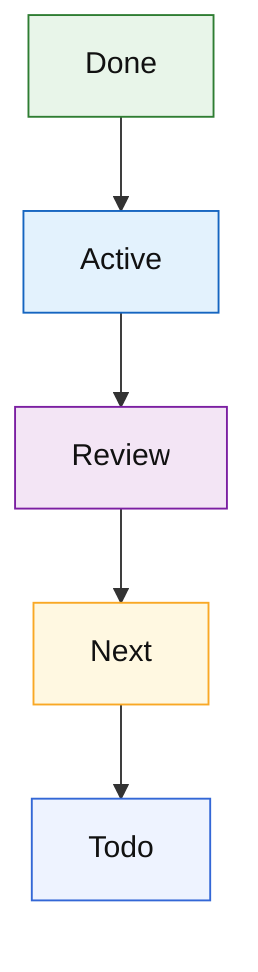

## Epics overview

Every epic is shown here with its status color, so the whole set is legible at
a glance: what is in progress, what is done, and what exists but has not
started. In-progress epics also have a detailed roadmap further down. Finished
epics keep only their node here. Update a node's color when an epic opens,
starts, or closes.

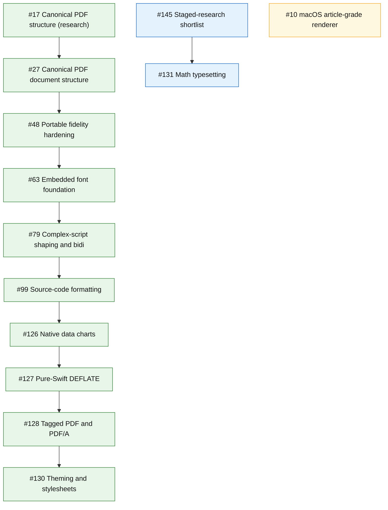

## Completed epics

These epics are fully landed and their child issues all closed, so their phase
diagrams have been retired to keep the roadmap focused on active work. The work
itself is described in the sections below and under `Packages/Sources/MarkdownPDFDocumentation/MarkdownPDFDocumentation.docc/Research/`.

- [#27](https://github.com/mihaelamj/MarkdownPDF/issues/27): canonical PDF document structure.
- [#48](https://github.com/mihaelamj/MarkdownPDF/issues/48): portable article-grade fidelity hardening.
- [#63](https://github.com/mihaelamj/MarkdownPDF/issues/63): portable embedded-font foundation.
- [#79](https://github.com/mihaelamj/MarkdownPDF/issues/79): complex-script shaping and bidi.

## Current Hardening

For issue #145, update this diagram after every child PR merge before starting
the next child issue.

```mermaid
flowchart TD
    H0["#95<br/>Hard Markdown fixture corpus<br/>Done"]
    H1["#97/#98<br/>A4 and external fixtures<br/>Done"]
    H2["#99<br/>Source-code formatting epic<br/>Done"]
    H2A["#101<br/>Literature research<br/>Done"]
    H2B["#102<br/>Compare with renderer<br/>Done"]
    H2C["#103<br/>Portable code model<br/>Done"]
    H2D["#112<br/>Remove quote strokes<br/>Done"]
    H2E["#104<br/>Formatting baseline<br/>Done"]
    H2F["#105<br/>Visual witnesses<br/>Done"]
    H2G["#113<br/>Image inclusion audit<br/>Done"]
    H2H["#106<br/>Syntax coloring study<br/>Done"]
    H2I["#118<br/>Roadmap colors<br/>Done"]
    H2J["#119<br/>Crazy markdown fixtures<br/>Done"]
    H2K["#120<br/>Portable syntax coloring<br/>Done"]
    H2L["#122<br/>CJK + diacritics<br/>Done"]
    H2M["#135<br/>Screenshot layout regressions<br/>Done"]
    H2N["#123<br/>RTL manuscript<br/>Done"]
    H2O["#141<br/>Prove #135 witness<br/>Done"]
    H2R["#146<br/>Preserve staged research<br/>Done"]
    H2P["#142<br/>Line-break correctness<br/>Done"]
    H2Q["#143<br/>More syntax languages<br/>Done"]
    H4["#145<br/>Staged-research shortlist epic<br/>Active"]
    H4A["#126<br/>Native charts<br/>Done"]
    H4B["#127<br/>Pure-Swift DEFLATE<br/>Done"]
    H4C["#128<br/>Tagged PDF and PDF/A<br/>Done"]
    H4D["#129<br/>Footnotes and tasks<br/>Done"]
    H4E["#130<br/>Theming model<br/>Done"]
    H4F["#131<br/>Fixed delimiters merged<br/>Active"]
    H4G["#138<br/>Apple and custom fonts<br/>Done"]
    H3["#100<br/>Named page sizes<br/>Done"]
    H4H["#137<br/>Vendor canonical references<br/>Done"]
    H5["#194<br/>Fix embedded /W width scaling<br/>Done"]
    H6["#195<br/>Full witness battery on font fixtures<br/>Done"]
    H7["#197<br/>Tolerate tiny math glyphs<br/>Done"]
    H8["#198<br/>Diverse multilingual showcase corpus<br/>Done"]
    H9["#199<br/>Showcase across popular page formats<br/>Done"]
    H11["#203<br/>Extract TeX-math engine to shared MathTypeset package<br/>Done"]
    H10["#200<br/>Expand line height for tall inline math<br/>Next"]

    H0 --> H1
    H1 --> H2
    H2 --> H2A --> H2B --> H2C --> H2D --> H2E --> H2F --> H2G --> H2H --> H2I --> H2J --> H2K --> H2L --> H2M --> H2N --> H2O --> H2R --> H2P --> H2Q
    H2Q --> H4 --> H4A --> H4B --> H4C --> H4D --> H4E --> H4F --> H4G --> H4H
    H4G --> H5 --> H6 --> H7 --> H8 --> H9 --> H11 --> H10
    H4 --> H3

    classDef done fill:#e8f5e9,stroke:#2e7d32,color:#111;
    classDef active fill:#e3f2fd,stroke:#1565c0,color:#111;
    classDef review fill:#f3e5f5,stroke:#7b1fa2,color:#111;
    classDef next fill:#fff8e1,stroke:#f9a825,color:#111;
    classDef todo fill:#eef3ff,stroke:#3367d6,color:#111;
    class H0,H1,H2 done;
    class H2A,H2B,H2C,H2D,H2E,H2F,H2G,H2H,H2I,H2J,H2K,H2L,H2M,H2N,H2O done;
    class H2P,H2R done;
    class H2Q done;
    class H4 active;
    class H4A done;
    class H4B done;
    class H4C done;
    class H4D done;
    class H4E done;
    class H4F active;
    class H4G done;
    class H4H done;
    class H3 done;
    class H5 done;
    class H6 done;
    class H7 done;
    class H8 done;
    class H9 done;
    class H11 done;
    class H10 next;
```

## Math typesetting roadmap

Epic [#131](https://github.com/mihaelamj/MarkdownPDF/issues/131) is the
standalone pure-Swift TeX-math subset. LaTeX is banned by the project boundary,
so inline `$...$` and display `$$...$$` are parsed, laid out by a box-and-glue
engine, and emitted as ordinary PDF text and rule drawing; unsupported
constructs render as visible source. Update this diagram after every child PR
merge.

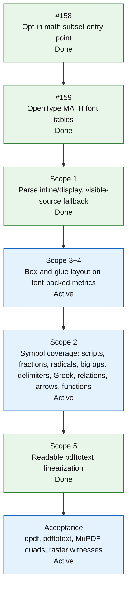

## macOS article-grade renderer roadmap

Epic [#10](https://github.com/mihaelamj/MarkdownPDF/issues/10) makes
`MarkdownPDFMac` the high-quality macOS product for scientific and technical
articles while keeping the portable core Linux-buildable. The mac product may
use Apple-native APIs such as CoreGraphics, CoreText, and ImageIO; the core
package and Linux product must not import Apple-only frameworks. No child issue
has started yet.

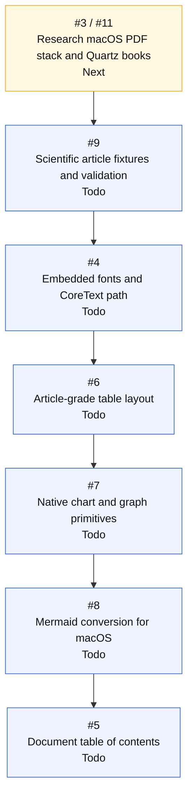

## License

See [LICENSE](LICENSE).
