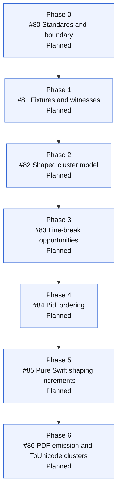

# Complex script shaping and bidi roadmap

Status: seeded by #71 on 2026-06-01.

Scope: this note defines the next epic after the Latin-first embedded-font
foundation. It is portable macOS and Linux research. It is not a macOS-only
plan, not an iOS claim, and not an implementation promise until source and tests
exist.

## Current boundary

The current portable renderer can embed caller-provided TrueType data and write
Type 0 / CIDFontType2 text with ToUnicode maps for the Latin-first profile. That
profile intentionally does not claim complex-script shaping, bidirectional
layout, ligatures, mark positioning, vertical writing, ruby text, emoji, color
fonts, variable fonts, or full OpenType shaping.

Unsupported text must not silently become a quality claim. Future issues need
fixtures and witnesses before they can claim support for any script or feature.

## Standards and source anchors

Unicode UAX #14 defines line-break opportunities, but final line selection is a
higher-level layout decision:

https://www.unicode.org/reports/tr14/

Unicode UAX #9 defines bidirectional text ordering and explicit formatting
controls:

https://www.unicode.org/reports/tr9/

OpenType defines glyph substitution and positioning tables needed for many
scripts:

https://learn.microsoft.com/en-us/typography/opentype/spec/overview

HarfBuzz documents shaping as transforming Unicode code points into positioned
glyphs from a selected font. Its concepts are useful, but HarfBuzz itself is a C
dependency and is outside the shared renderer boundary:

https://harfbuzz.github.io/shaping-concepts.html

## Portable versus platform-specific

Portable core work must be pure Swift and Linux-buildable. It can use Unicode
and OpenType specifications as implementation inputs, but it must not depend on
CoreText, CoreGraphics, AppKit, UIKit, PDFKit, WebKit, browser renderers, LaTeX,
JavaScript, Python, shell renderers, or C shaping/PDF/Markdown libraries.

A future macOS product adapter may investigate CoreText shaping or measurement,
but that work belongs outside the shared renderer. macOS results do not imply
Linux behavior and do not imply iOS support. iOS support remains unimplemented
and untested until an explicit iOS target and witness suite exist.

## First fixture groups

The first fixture policy should cover:

- Latin ligatures and combining marks.
- Arabic or another script that requires contextual joining and bidi handling.
- Hebrew or another RTL script with mixed numbers and LTR words.
- At least one Indic script with combining marks or reordering behavior.
- Thai or Khmer no-space line-break opportunities.
- Unsupported controls, scripts, fonts, or shaping features that must throw
  typed errors or render explicit visible fallback.

Fixtures should keep font handling repository-safe. Do not commit font binaries.
Use generated Swift fixtures where possible and CI-installed or
environment-provided open fonts for smoke tests.

## Text model requirement

The next implementation cannot treat one Unicode scalar as one glyph forever.
The internal model needs separate fields for:

- Source Unicode scalar range.
- Cluster source text used for extraction.
- Glyph ids selected by the shaper.
- Glyph advances and optional offsets.
- PDF character codes assigned by the subset planner.
- ToUnicode scalar sequences for each emitted PDF character code or cluster.

This model must support one-to-one, one-to-many, many-to-one, and many-to-many
relationships. Examples include ligatures, split glyphs, combining sequences,
and shaped clusters.

## Ordered issues

1. #80 Research Unicode line breaking, bidi, and shaping boundaries.
2. #81 Add complex-script fixture corpus and witness policy.
3. #82 Model shaped text clusters and multi-scalar ToUnicode data.
4. #83 Add portable Unicode line-break opportunity detection.
5. #84 Add portable bidi paragraph ordering profile.
6. #85 Prototype pure Swift OpenType shaping increments.
7. #86 Emit shaped embedded-font clusters with ToUnicode witnesses.

## Roadmap

## Witness policy

Every behavior issue in #79 needs evidence that matches the claim:

- qpdf structural validation with no warnings.
- Poppler text extraction for source-faithful text.
- Poppler `pdftotext -tsv` geometry for word and line boxes.
- MuPDF structured text for character quads.
- Poppler and MuPDF raster comparison for ink bounds.
- macOS and Linux verification for the shared renderer.

If a feature cannot meet that witness bar, the implementation must keep it
unsupported and visible rather than claiming support.
